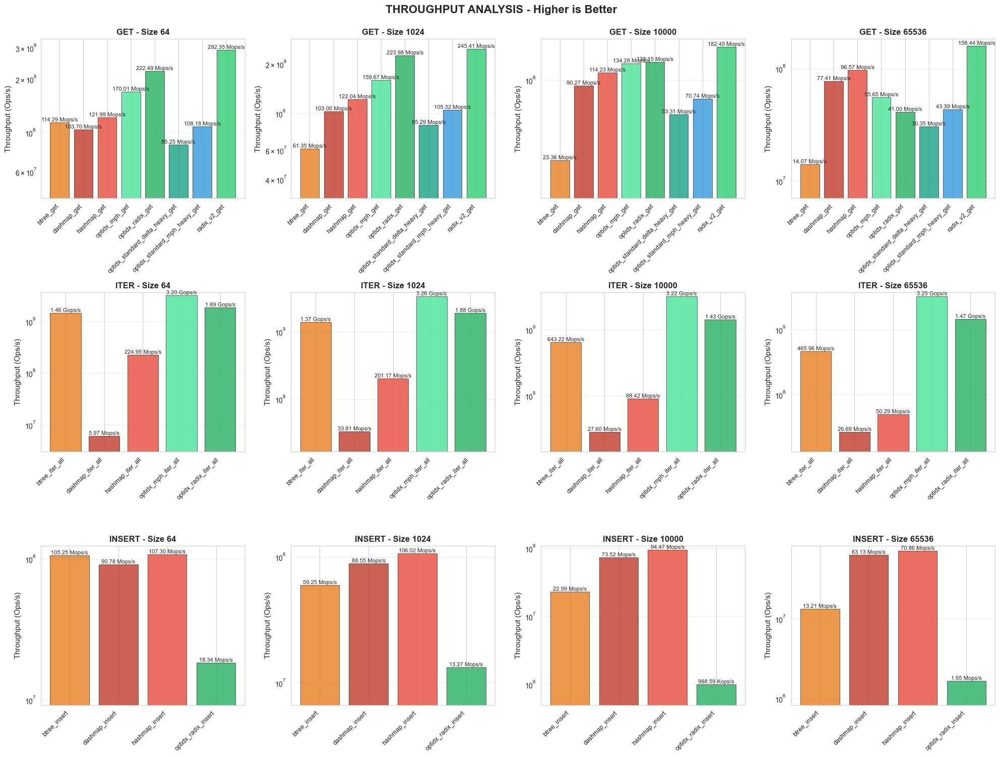
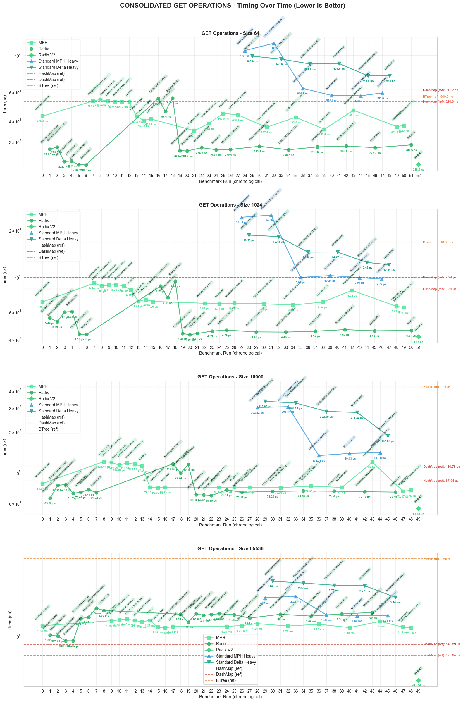
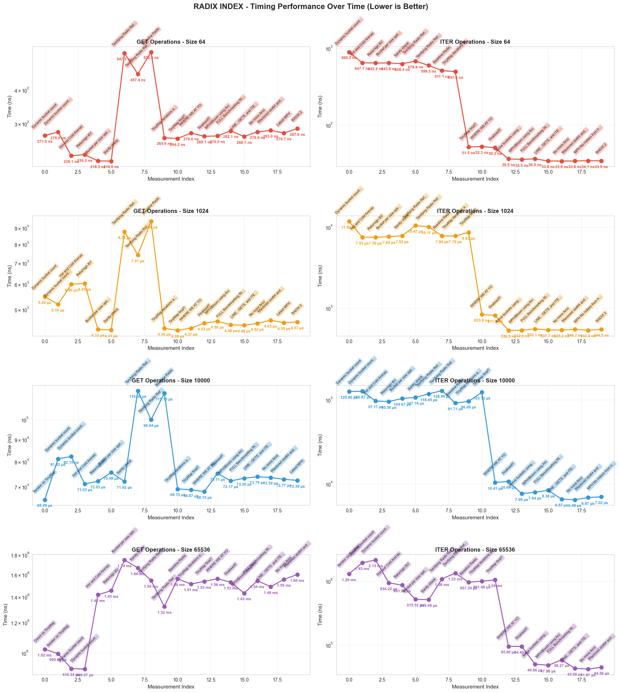

# radix-index

High-performance, lock-free data structures for real-time indexing and streaming. Extracted from the [Massive Graph](https://github.com/econic-ai/massive-graph) database engine.

## Data Structures

### Radix Index

A concurrent, cache-optimised bucketed radix-hash index designed for high-throughput `get`, `insert`, `delete`, and iteration.

**Architecture:**
- **Fixed global bucket count** chosen at initialisation — no global table resizing
- **Per-bucket growth** via immutable `BucketConfig` objects replaced atomically under epoch guards
- **Multi-chunk buckets** — each bucket can scale independently with contiguous chunks from a dedicated arena
- **Mask-driven publication** — writers store tag and record fields first, then publish via `fetch_or` on the occupancy mask; readers only see slots whose mask bit is set
- **First-class iteration** — iterators pin a single epoch guard and walk buckets/chunks directly over masks and slots

**Key features:**
- Lock-free reads via epoch-based reclamation
- User-supplied guard APIs (`*_with_guard`) to hoist a single guard across many operations
- Pre-hashed variants to avoid redundant hashing in hot paths
- fp8 fingerprints for fast prefilter before full key comparison (upgrade path to fp16)
- Clear separation: control plane (bucket metadata, configs) vs data plane (chunks, masks, fingerprints, records)
- Update semantics: "always new slot + tombstone old" — no in-place mutation of live slots

**Use case:** High-throughput index for point lookups and heavy iteration workloads in collaborative real-time systems.

### MPH Index

Immutable Minimal Perfect Hash index for O(1) lookups with zero collisions.

**Key features:**
- Perfect hash function maps keys directly to slots
- 16-bit fingerprints for fast rejection before key comparison
- Designed as a read-only base layer paired with RadixIndex for mutations

### Segmented Stream

Append-only, lock-free stream composed of fixed-size pages.

**Key features:**
- Multi-writer append via atomic reservation
- Lock-free cursor reads (observe only committed entries)
- Optional page pooling, recycling, and prefilling
- Extremely fast reads: ~2.9 G ops/s (contiguous page slices)

### SPSC Ring

Bounded, lock-free single-producer single-consumer ring buffer.

**Key features:**
- Power-of-two capacity with mask-based indexing
- Cache-line padding (128B on Apple Silicon, 64B elsewhere)
- Batched publication mode: up to 400M transfers/s
- No blocking — returns `Err` when full, `None` when empty

## Benchmarks

Benchmarked against `HashMap`, `DashMap`, and `BTreeMap` at sizes 64, 1K, 10K, and 65K entries.



**Key results:**
- **GET**: Radix Index achieves 158–292 M ops/s, competitive with HashMap
- **ITER**: MPH Index reaches 3.2 G ops/s; Radix Index at 1.4–1.9 G ops/s (zero-allocation)
- **INSERT**: Radix Index delivers 63–107 M ops/s across sizes

| Structure | Operation | Throughput |
|-----------|-----------|------------|
| Segmented Stream | Append | 55M ops/s (single-writer) |
| Segmented Stream | Read | 2.9G ops/s |
| SPSC Ring | Transfer (batched) | 400M/s |

<details>
<summary><strong>Performance over time</strong></summary>

GET operations timing across development iterations:



Radix Index optimization journey (GET and ITER):



</details>

See `bench_analysis/analyze_benchmarks.ipynb` for full analysis.

## Usage

```rust
use radix_index::mph_delta_index::RadixIndex;
use crossbeam_epoch as epoch;

// Create index with fixed bucket count
let index: RadixIndex<String, u64> = RadixIndex::with_capacity(10_000, 100_000);

// Hoist a single guard across many operations (recommended for batches)
let guard = epoch::pin();

// Insert
index.insert_with_guard(&"key".to_string(), 42, &guard);

// Lookup
if let Some(value) = index.get_with_guard(&"key".to_string(), &guard) {
    println!("Found: {}", value);
}

// Pre-hashed lookup (avoids redundant hashing in hot paths)
let hash = radix_index::mph_delta_index::util::hash64(&"key".to_string());
if let Some(value) = index.get_with_hash(&"key".to_string(), hash, &guard) {
    println!("Found: {}", value);
}

// Iterate under a single guard (zero allocations, mask-driven)
for value in index.iter(&guard) {
    println!("{}", value);
}
```

## Project Structure

```
radix-index/
├── architecture.md         # Detailed architecture & implementation plan
├── mph_delta_index/
│   ├── radix_index.rs      # Bucketed radix-hash index (current)
│   ├── radix_index_v2.rs   # POC implementation
│   ├── mph_index.rs        # Minimal perfect hash index
│   ├── mph_indexer.rs      # MPH function builder
│   ├── optimised_index.rs  # Combined MPH + Radix
│   ├── tiny_map.rs         # Compact sorted map for buckets
│   ├── arena.rs            # Arena allocator for chunks
│   ├── bloom.rs            # Bloom filter
│   └── epoch_tracker.rs    # Diagnostics for epoch reclamation
├── segmented_stream/
│   └── segmented_stream.rs # Append-only lock-free stream
├── spsc/
│   └── spsc.rs             # SPSC ring buffer
└── zerocopy_storage/
    └── mod.rs              # Zero-copy storage utilities
```

See [architecture.md](./architecture.md) for detailed design rationale and experiment plans.

## License

Apache 2.0

---

Part of the [Econic](https://econic.ai) infrastructure for collaborative intelligence.

