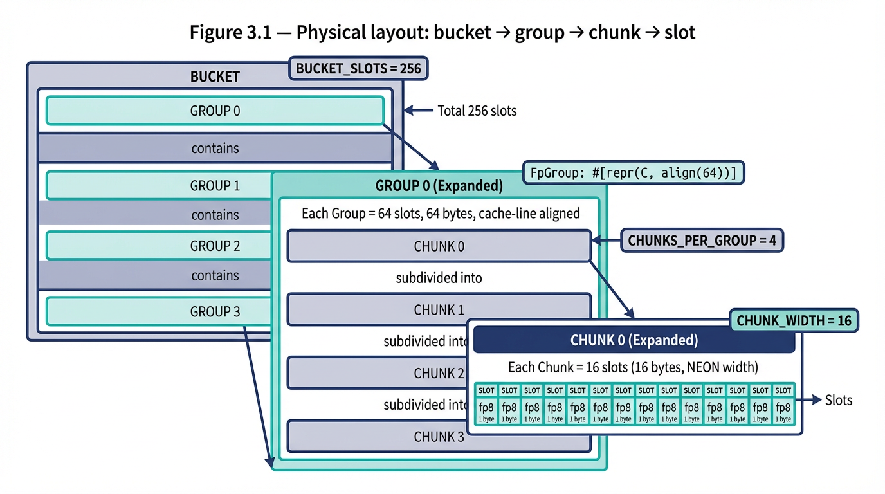
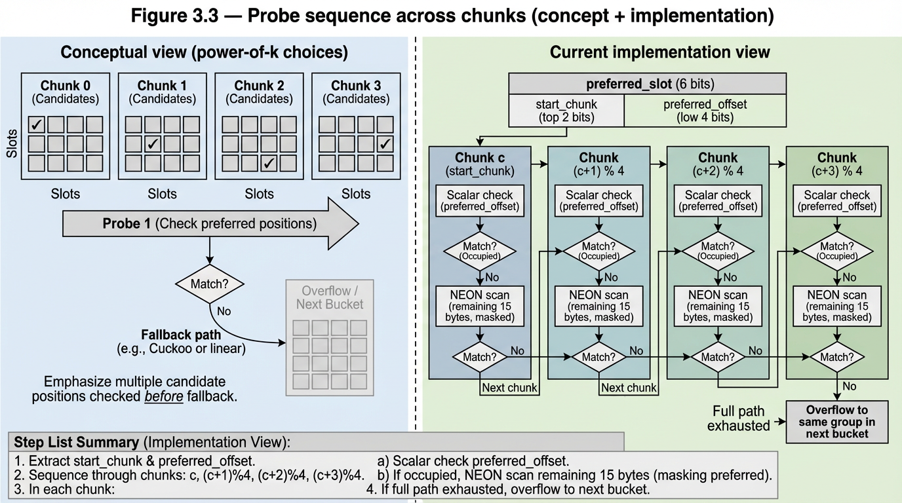
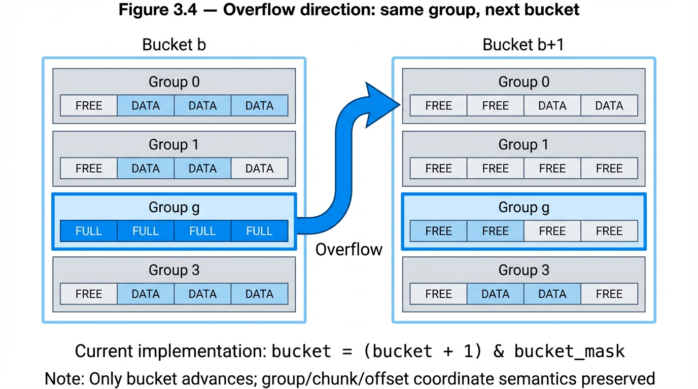
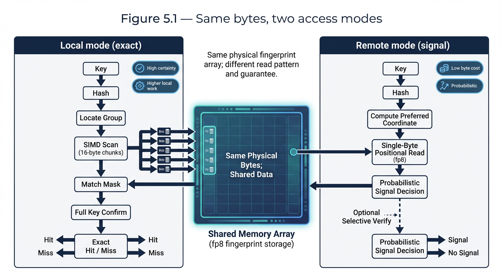
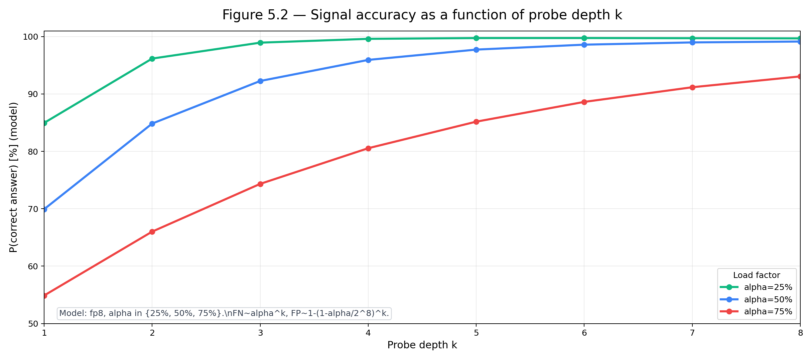

# Redesigning the humble radix hash index for GPU-accelerated distributed intelligence systems.

**Jordan — Datakey Pty Ltd / UNSW**

---

## Blog Introduction — Every book has a preferred place: Local exactness, Distributed Probability.

<!-- TONE: opinionated, quirky, passionate. This is the hook, not the research. Express the value proposition of the novel idea. -->

- If you've found yourself bit-wrangling on the SIMD floor, optimising operations in the nanosecond and picosecond range — this research may interest you.
- If you have a particular interest in the emergence of distributed intelligent systems, or recognise the game-changing nature of Apple Silicon's CPU-GPU architecture as a direct competitor to NVIDIA's market dominance, or found recent breakthroughs in computer science on space and time geometry fascinating — you may also find value in this line of exploration.

**What this research explores:**

- Redesign of a radix hash tree, a data structure commonly used in [add examples: routers, file systems, in-memory databases, key-value stores].
- Designed for **speed** — specifically traversal: find, iterate, compare.
- Designed for **algebraic predicates**, particularly as applied to Bayesian inference — A ∪ B, A ∩ B, A in B but not C.
- Designed for **fast delta operations** — identifying differences as distributions.
- Designed to **leverage GPU hardware** that performs these operations more effectively.

**Apple Silicon framing:**

- Although not explored exhaustively in the paper, we design around Apple Silicon.
- Unified GPU-CPU memory architecture means: no dual indexes, no copying between CPU and GPU for operations better performed on one than the other.
- The comparison is CPU vs CPU+GPU on unified memory.
- General assertion (not proven): NVIDIA or similar discrete GPU would likely yield better raw GPU performance, but the additional costs of memory transfer or dual index storage can only degrade total system performance. Stated as a position, not a proof.

**The operational gap — local exactness vs distributed probabilistic certainty:**

- Using bit entropy and preferred placement.
- Moving away from guaranteed membership rules expected from local index data structures.
- Moving toward the realm of Bloom and cuckoo filters (partial one-sided guarantees) and vector spaces (geometric certainties on relationships rather than membership).
- The index's internal geometric structure provides key benefits over both approaches.
- Current iteration applies to uniformly distributed keys (16-byte hashes) — the realm usually served by Bloom and cuckoo filters.
- The same value holds for clustered indexes such as vectors (LSH) and distinct sets such as database indexes and graphs.

**Application — distributed databases:**

- Distributed indexes only have application in distributed databases and their many names — Content Distribution Networks (CDN) being one.
- Compute time on data structures directly determines responsiveness.
- Inefficient data transmissions lead to clogged operations.
- Clogging is not just about content distributed from node A to the network — it's about determining *where content should be*. It's about the coordination or intelligence layer itself.
- Particularly important in the frame of a CDN moving from pull-and-cache to proactive push on probability of utility.

**Closing segue:**

- The arena of software and data architectures is changing.
- Moving to systems built on probabilistic outputs — nowhere more evident than in the explosion of intelligent systems across the digital landscape.
- What was once absolutely guaranteed gives way to "within acceptable bounds based on this costing framework."
- How much do you want absolute certainty, meets: is 1% inaccuracy worth half the costs?

---

## 1. The Problem Space

- A general statement on the problem and a very brief intro into the tools used to solve it.
- [To be fleshed out — frame the dual-structure problem, the cost of maintaining separate probabilistic and exact structures, the question of unification.]

**Figure 1.1 — The dual-structure problem**

---

## 2. The Geometry of Entropy: Placing Things Where They Can Be Found

- Entropy as a means of ordering preferred location.
- The structure of bit entropy applied to a single array:
  - Buckets
  - Groups
  - Chunks
  - Slots
- Preferred slot placement of fp:
  - fp8 provides quick probe capabilities.
  - Preferred slot provides bias location separate from the fp8.
  - A key maps (bucket, group, chunk, preferred slot) → to the fp8.
- Position bits and fingerprint bits must be drawn from non-overlapping hash segments.
- On collision, bucket, group, chunk can be recalculated with new bits maintaining random distribution properties.

**Table 2.1 — Discrimination: dependent vs independent bit allocation**

| Scheme | Stored bits | Position bits | Total discrimination | FPR |
|---|---|---|---|---|
| fp8 as placement (same bits) | 8 | 8 (same) | 8 | 1/255 |
| 4-bit offset + fp8 | 8 | 4 (independent) | 12 | 1/4,080 |
| 6-bit slot + fp8 | 8 | 6 (independent) | 14 | 1/16,320 |
| Full coordinate tuple + fp8 | 8 | 18+ (independent) | 26+ | 1/67M |

**Figure 2.1 — The hash as a segmented bar**

**Figure 2.2 — Positional entropy compounding through the hierarchy**

### Geometry of the layout

- The geometry aligns as the most mathematically efficient use of bit entropy for preferred placement with optimal usage of extra bits for collision detection.
- This is mathematically the most efficient — differentiated from practical applications where hardware designs enforce a limit or bound on efficiency.

---

## 3. The Index Architecture

<!-- Bit sequence: Bucket, fp8, group, chunk, preferred slot. -->
<!-- NOTE: fp8 before all directional bits except bucket to facilitate shift to unused bits for recalculation on collision. We do not need this behaviour for buckets as they are sequentially probed. -->
<!-- fps in 64-byte cache-line alignment and why it matters. Diagram of arrays. -->
<!-- The probe sequence: power-of-k-choices across chunks, scalar hot path, NEON sequential cold fallback. -->
<!-- Overflow direction: same group, next bucket — preserves the coordinate tuple while allowing sufficient scattering of clusters at the chunk and group level. -->

**Figure 3.1 — Physical layout: bucket → group → chunk → slot**
*A single bucket (256 bytes) = 4 groups (64 bytes each, cache-line-aligned), each group = 4 NEON-width chunks (16 bytes), each chunk = 16 fp8 slots. Annotations: cache line boundaries and NEON load widths.*

**Figure 3.2 — Hash bit partitioning for a concrete configuration**
*capacity_bits=20: Bucket (12 bits), group (2 bits), slot/chunk (6 bits → chunk 2 bits + offset 4 bits), fp8 (8 bits), overflow (34 bits spare).*

**Figure 3.3 — The probe sequence: power-of-k-choices across chunks**
*A single group (4 chunks). Hash derives different preferred offset per chunk. Scalar probe sequence: p0→p1→p2→p3. If all four occupied, NEON fallback.*

**Figure 3.4 — Overflow direction: same group, next bucket**
*Group g in bucket b overflows to group g in bucket b+1, not group g+1 in bucket b. Group coordinate fixed by hash. Only the bucket advances. The (group, chunk, offset, fp8) tuple is preserved through overflow.*

---

## 4. Baseline Build

<!-- Build layer by layer, measure each addition. Inline benchmarks per design decision. -->

### 4.1 Against the Baseline

<!-- 256K index. Comparison against hashbrown (Swiss Table) as production baseline. Honest accounting. -->

*Personal Note: The radix index at certain operations will never beat a generic Swiss Table due simply to the fact that there are more SPU operations that must be performed. Having said that, the same is true in reverse — Swiss Table cannot compete on operations where the more efficient layout of information in memory matters.*

**Table 4.1 — Final benchmark matrix: radix tree vs hashbrown**

**Figure 4.1 — Latency progression across runs**
*Matrix line chart: columns = operations (insert, lookup hit, lookup miss, iter), rows = occupancy levels. Run-by-run radix-tree mean latency with optimisation-tag labels and hashbrown reference baseline.*

**Table 4.2 — Iteration performance: radix tree vs hashbrown**

| Load | hashbrown | radix_tree | Ratio |
|---|---|---|---|
| 1% | 15.3 µs | 13.0 µs | 1.2× faster |
| 25% | 272 µs | 43.9 µs | 6.2× faster |
| 50% | 523 µs | 101 µs | 5.2× faster |
| 75% | 666 µs | 207 µs | 3.2× faster |

### 4.2 The SIMD Floor vs Scalar Scans

<!-- Where scanning is cheaper than directing. -->

**Table 4.3 — Run 1 vs Run 2: SIMD scan vs scalar byte-by-byte**
*Where SIMD wins (high load) and where scalar wins (low load). The crossover point.*

<!-- placeholder table or chart image -->

**Table 4.4 — Probe trace: where lookups resolve**
*Occupancy analysis data. Resolution level distribution at each load factor. 99.5% scalar preferred hit rate as headline.*

<!-- placeholder table or chart image -->

**Table 4.5 — Run 4 vs Run 5: pure NEON vs scalar-first with NEON fallback**
*Scalar pre-check recovering low-load performance while retaining NEON at high load.*

<!-- placeholder table or chart image -->

### 4.3 Linear Probing, Clustering, and the Need to Maintain Random Distribution

<!-- Knuth's predictions vs measured. Occupancy analysis. 12.4% spill to chunks 1-3 at 75% load. -->
<!-- Where random distribution impedes performance benefits of linear scanning in SIMD/NEON, and how this is less prevalent but still a consideration in GPU optimisation (effectively a linear probe). -->

**Table 4.6 — Knuth's predicted probe lengths vs observed**

| Load (α) | Knuth predicted (miss) | Observed: chunk 0 only | Observed: chunks 1-3 | Observed: overflow |
|---|---|---|---|---|
| 25% | 0.89 slots | 99.97% | 0% | 0% |
| 50% | 2.5 slots | 99.5% | 0.5% | 0% |
| 75% | 8.5 slots | 87.6% | 12.4% | 1.6% |

<!-- placeholder — refine with actual measurements -->

**Figure 4.2 — Chunk occupancy distribution at each load factor**

**Table 4.7 — P(all k preferred positions occupied) by load factor**

| Load (α) | k=1 | k=2 | k=4 |
|---|---|---|---|
| 25% | 25% | 6.3% | 0.4% |
| 50% | 50% | 25% | 6.3% |
| 75% | 75% | 56.3% | 31.6% |

**Table 4.8 — Benchmark: power-of-k-choices vs linear probing**
*Hit and miss latency comparison at each load factor, showing clustering elimination.*

<!-- placeholder table or chart image -->

---

## 5. Enter GPU into GPU-Friendly Operations

*Personal Note: Baselining GPU operations without utilising Apple's unified architecture. Results did show improvements compared to CPU operations at sufficient loads. On the whole they could only be worse than the same operations on GPUs optimised for unified memory, and so were not included in the results.*

### 5.1 Index Size Matters

- Apple unified memory aside, there are simply additional costs in GPU utilisation that ensure small indexes (e.g. 256K) are too costly.
- As index sizes expand, this cost is amortised and the GPU architecture — more aligned with large parallelisable operations — begins to show.
- Illustrate the iteration across benchmarks for index sizes.

### 5.2 GPU/CPU Factor Performance

- Frame the crossover profile from m1 benchmarks: GPU slower at ≤256K, near parity at 1M, 3-7× faster at 8M-128M.

### 5.3 Framing the Greedy Search

- Example of early exit strategy and comparable performance.
- Where GPU linear scan can vs cannot beat CPU directed probing.
- The tension: if hardware-accelerated linear scan matches entropy-directed probing at sufficient scale, the value of positional encoding becomes a function of table size and available compute.

### 5.4 Probabilistic Differential

- Frame the use of fingerprint diff (m1.1) as a GPU-accelerated sync primitive.

### 5.5 Algebraic Predicates

- Set intersection (m1.2) — 2-dimensional.
- Multi-set predicate evaluation (m1.3) — 3-dimensional.
- Mask-based generalised kernel: one kernel, any predicate via lookup table encoding.

### 5.6 GPU Conclusions

- [To be developed — summarise GPU findings, crossover points, operation shapes that benefit.]

---

## 6. Probabilistic Certainties

### 6.1 Existing Pathways for Probabilistic Certainty

**Bloom and Cuckoo Filters:**

- Describe the structures and their guarantees.
- Describe the flaws:
  - Separate from the index — different data structure, different storage, different coordination mechanics.
  - Costly recalculation on delete, unless counting Bloom — which is 4× the space.
  - **Cannot communicate in deltas.** This is important.

**Vector Similarity:**

- Describe the approach.
- Address fundamental differences — solving a different problem, not readily associated with distributed databases.
- Describe fundamental sameness — addressing probabilistic relationships via geometry.
- Illustrate examples in the wild: Milvus distributed vector search, algorithms like LSH that provide similarity certainties of diminishing confidence as the bit comparison reduces.

### 6.2 Bringing It Together — Distributed Database Operations in CDNs

- The coordination layer problem.
- Pull-and-cache vs proactive push on probability of utility.
- How the index's signal serves routing, sync, and replication priority.

### 6.3 Apples to Apples: Comparing Costs

**Total cost of ownership framework:**

- Read/write-heavy workloads.
- Delete/replace-heavy workloads.
- Large networks — cost of syncing.

**Architecture A (index + Bloom) vs Architecture B (index only):**

- Per-query cost comparison (m2.1 data).
- Per-mutation maintenance cost.
- Delete handling — Bloom degradation vs positional probe stability.
- Remote sync cost — full retransmit vs delta diff.
- Storage scaling across node count.

---

## 7. The Signal: What the Index Tells You Without Asking

<!-- This section may merge with or follow from §6, depending on narrative flow. -->

**Figure 7.1 — Same bytes, two access modes**

- The signal equation: P(correct answer) as function of (α, k, f, d).
- Precision vs recall at each probe depth.
- Single-byte miss determination: 99.7%+ at 75% load.
- The independence requirement as the mechanism that makes the signal useful rather than noise.

**Figure 7.2 — Signal accuracy as a function of probe depth k**

---

## 8. The Declining Guarantee: A Characterisation

**Figure 8.1 — The verification cost gradient**

- The probability gradient from slot to cluster.
- Verification cost as the governing variable.
- Worked examples: when to verify, when to act on the signal.

---

## 9. Partial Keys and What They Imply

**Figure 9.1 — What is disclosed: position + fp8 vs the full key**

**Figure 9.2 — Differential sync: exchanging position deltas**

- Privacy-adjacent properties.
- Differential sync as the natural communication mode.
- Connection to approximate private set intersection.
- Future direction: LSH as alternative hash family — same architecture, similarity semantics.

---

## 10. Open Questions

- Formal bounds on the signal equation under adversarial key distributions.
- Optimal k for a given network cost model.
- Composability with geometric sub-array sizing (Farach-Colton connection).
- The LSH instantiation: does the architecture hold for similarity?
- Behaviour at extreme scale — millions of nodes, billions of keys.

---

## 11. Concluding Remarks

- What we built, what we found, what it's worth.
- The index works. The signal is free. The equation tells you how much to trust it.

**Table 11.1 — Summary: what the index provides**

| Property | Value |
|---|---|
| Local lookup (hit, 1% load) | ~2.8 ns (1.0× hashbrown) |
| Local lookup (hit, 75% load) | ~8.2 ns (2.4× hashbrown) |
| Iteration (50% load) | ~101 µs (5.2× faster than hashbrown) |
| Probabilistic miss (k=1, 75% load) | 99.71% correct in 1 byte read |
| Discrimination (full coordinate + fp8) | 26+ bits from 8 stored |
| Auxiliary filter storage required | zero (fp8 array is the primary index) |

---

## References

- Azar, Y., Broder, A. Z., Karlin, A. R., & Upfal, E. (1994). Balanced Allocations. *STOC*, 593–602.
- Bender, M. A., Conway, A., Farach-Colton, M., Kuszmaul, W., & Tagliavini, G. (2021). Iceberg Hashing. *JACM*, 70(6), 1–51.
- Farach-Colton, M., Krapivin, A., & Kuszmaul, W. (2025). Optimal Bounds for Open Addressing Without Reordering. arXiv:2501.02305v2.
- Knuth, D. E. (1963). Notes on "Open" Addressing. Unpublished memorandum.
- Kulukundis, M. (2017). Designing a Fast, Efficient, Cache-friendly Hash Table, Step by Step. CppCon 2017.
- Pagh, R., & Rodler, F. F. (2004). Cuckoo Hashing. *Journal of Algorithms*, 51(2), 122–144.
- Pandey, P., Bender, M. A., Johnson, R., & Patro, R. (2017). A General-Purpose Counting Filter. *SIGMOD*, 775–787.
- Peterson, W. W. (1957). Addressing for Random-Access Storage. *IBM J. Res. Dev.*, 1(2), 130–146.
- Vöcking, B. (2003). How Asymmetry Helps Load Balancing. *JACM*, 50(4), 568–589.
- Yao, A. C. (1985). Uniform Hashing is Optimal. *JACM*, 32(3), 687–693.