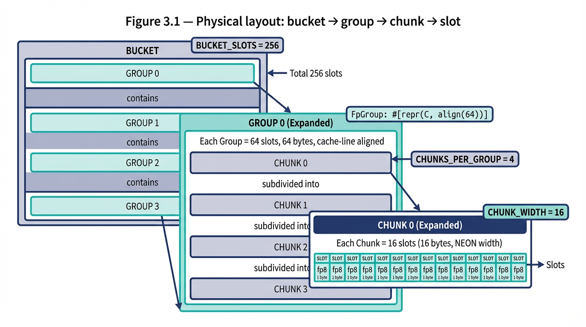

# Building an Index That Works Locally and Distributedly — and What We Found Along the Way

**Jordan — Datakey Pty Ltd / UNSW**

---

<!-- First person, blog voice. The problem, what the paper explores, preliminary conclusion. -->
<!-- mgraph, distributed deltas, large indexes across nodes. -->
<!-- Can one index serve both exact local lookup and probabilistic distributed inference? -->
<!-- Preliminary conclusion: yes — the mechanism is positional entropy, the address is part of the key. -->

---

# Entropy-Directed Placement: An Exact-Match Index with a Probabilistic Signal

---

## 1. The Problem Space

<!-- Two requirements pulling in different directions: exact and fast locally, probabilistic and cheap distributedly. -->
<!-- Why these are currently served by separate structures. -->
<!-- Why that's expensive: dual maintenance, dual memory, dual update paths. -->
<!-- The question: is there a single architecture that covers both? -->

**Figure 1.1 — The dual-structure problem**
*Diagram showing a typical node architecture: primary hash index alongside a separate Bloom filter, with arrows indicating the dual update paths, dual memory budgets, and synchronisation overhead between them. Contrast with a single-structure alternative where both roles are served by the same bytes.*

<!-- placeholder table or chart image -->

---

## 2. The Geometry of Entropy: Placing Things Where They Can Be Found

<!-- Hash bits as a finite budget. -->
<!-- Every structural decision consumes bits, every consumed bit encodes position. -->
<!-- Position is free information — stored implicitly in the geometry. -->
<!-- The (position, fingerprint) composite: stored bits + positional bits = total discrimination. -->
<!-- The quotient filter connection — not new in isolation, but the hierarchical compounding is. -->
<!-- Worked example: fp8 at a computed address in a 3-layer hierarchy — how many bits of discrimination, how many stored. -->

**Figure 2.1 — The hash as a segmented bar**
*A 64-bit hash laid out as a horizontal bar, divided into labelled non-overlapping segments: bucket bits, group bits, chunk bits, offset bits, fingerprint bits, overflow/spare bits. Each segment colour-coded by its structural role. Annotation showing which segments encode position (free) versus which are stored (fp8).*

<!-- placeholder table or chart image -->

**Figure 2.2 — Positional entropy compounding through the hierarchy**
*Stacked bar or pyramid diagram showing how discrimination bits accumulate at each layer. Bottom: fp8 (8 stored bits). Each layer above adds positional bits: offset (4), chunk (2), group (2), bucket (12). Total discrimination at the top: 28 bits from 8 stored. Annotation: "18 bits encoded for free in the geometry."*

<!-- placeholder table or chart image -->

### 2.1 The Independence Requirement

<!-- The critical design constraint: position bits and fingerprint bits must be drawn from non-overlapping hash segments. -->
<!-- If fp8 determines placement (same bits for both), total discrimination = 8 bits. -->
<!-- If separate bits determine placement, total discrimination = position bits + fingerprint bits. Independent checks, probability multiplies. -->
<!-- A false positive requires two independent coincidences: wrong element at the right position AND matching fingerprint. -->

**Table 2.1 — Discrimination: dependent vs independent bit allocation**
*The core table showing how reusing bits collapses discrimination while independent bits multiply it.*

| Scheme | Stored bits | Position bits | Total discrimination | FPR |
|---|---|---|---|---|
| fp8 as placement (same bits) | 8 | 8 (same) | 8 | 1/255 |
| 4-bit offset + fp8 | 8 | 4 (independent) | 12 | 1/4,080 |
| 6-bit slot + fp8 | 8 | 6 (independent) | 14 | 1/16,320 |
| Full coordinate tuple + fp8 | 8 | 18+ (independent) | 26+ | 1/67M |

<!-- Reusing bits buys nothing. Independent bits multiply discrimination. -->
<!-- This is the foundational constraint for the entire hash partitioning scheme — without it, the hierarchy adds structure but not information. -->
<!-- The hierarchy compounds: each layer draws from a fresh segment, each layer adds free bits. -->

---

## 3. The Index Architecture

<!-- Bucket, group, chunk, slot — the hierarchy. -->
<!-- Hash partitioning: which bits serve which layer. -->
<!-- Cache-line alignment and why it matters. -->
<!-- The probe sequence: power-of-k-choices across chunks, scalar hot path, NEON cold fallback. -->
<!-- Insert path: preferred offset in every chunk, preserving positional information through overflow. -->
<!-- Overflow direction: same group, next bucket — why this preserves the coordinate tuple. -->

**Figure 3.1 — Physical layout: bucket → group → chunk → slot**
*Memory diagram showing a single bucket (256 bytes) composed of 4 groups (64 bytes each, cache-line-aligned), each group divided into 4 NEON-width chunks (16 bytes each), each chunk containing 16 fp8 slots. Annotations showing the cache line boundaries and NEON load widths.*

<!-- placeholder table or chart image -->

**Figure 3.2 — Hash bit partitioning for a concrete configuration**
*Worked example for capacity_bits=20: the 64-bit hash divided into segments with exact bit widths and ranges. Bucket (12 bits), group (2 bits), slot/chunk (6 bits → decomposed into chunk 2 bits + offset 4 bits), fp8 (8 bits), overflow (34 bits spare). Annotated with how each segment maps to the physical layout.*

<!-- placeholder table or chart image -->

**Figure 3.3 — The probe sequence: power-of-k-choices across chunks**
*Diagram showing a single group (4 chunks). The hash derives a different preferred offset for each chunk. Arrows show the scalar probe sequence: check offset p0 in chunk 0, then offset p1 in chunk 1, then p2, then p3. If all four are occupied, fallback to NEON scan. Contrast with linear probing where displacement extends a single run.*

<!-- placeholder table or chart image -->

**Figure 3.4 — Overflow direction: same group, next bucket**
*Diagram showing two adjacent buckets. When group g in bucket b is full, the arrow points to group g in bucket b+1 — not to group g+1 in bucket b. Annotation: "Group coordinate fixed by hash. Only the bucket advances. The (group, chunk, offset, fp8) tuple is preserved through overflow."*

<!-- placeholder table or chart image -->

---

## 4. Building It: Benchmark-Driven Development

<!-- The approach: build layer by layer, measure each addition. -->
<!-- Inline benchmarks per design decision, not a separate results section. -->

### 4.1 The SIMD Floor

<!-- Where scanning is cheaper than directing. -->

**Table 4.1 — NEON register widths and loads per group**
*Showing why "one SIMD instruction scans 64 bytes" is wrong: NEON is 16 bytes per load, 4 loads per group.*

| Architecture | Register width | Loads for 64 bytes | Loads for 16 bytes |
|---|---|---|---|
| NEON (AArch64) | 128-bit / 16 bytes | 4 | 1 |
| SSE2 | 128-bit / 16 bytes | 4 | 1 |
| AVX2 | 256-bit / 32 bytes | 2 | 1 |
| AVX-512 | 512-bit / 64 bytes | 1 | 1 |

**Table 4.2 — Run 1 vs Run 2: SIMD scan vs scalar byte-by-byte**
*Benchmark comparison showing where SIMD wins (high load) and where scalar wins (low load). The crossover point.*

<!-- placeholder table or chart image -->

### 4.2 The Scalar Crossover

<!-- Where a byte read beats NEON setup. -->
<!-- 99.5% of hits resolve at the preferred offset — the occupancy data. -->

**Table 4.3 — Probe trace: where lookups resolve**
*The occupancy analysis data showing resolution level distribution at each load factor. The 99.5% scalar preferred hit rate as the headline number.*

<!-- placeholder table or chart image -->

**Table 4.4 — Run 4 vs Run 5: pure NEON vs scalar-first with NEON fallback**
*Benchmark showing the scalar pre-check recovering low-load performance while retaining NEON benefits at high load.*

<!-- placeholder table or chart image -->

### 4.3 Linear Probing and the Clustering Penalty

<!-- What Knuth predicted, what we measured. -->
<!-- Occupancy analysis: where elements actually land, how the probe trace distributes. -->
<!-- The 12.4% spill to chunks 1-3 at 75% load — primary clustering in action. -->

**Table 4.5 — Knuth's predicted probe lengths vs observed**
*Theoretical expected probe length for linear probing compared against measured probe trace distribution at each load factor.*

| Load (α) | Knuth predicted (miss) | Observed: chunk 0 only | Observed: chunks 1-3 | Observed: overflow |
|---|---|---|---|---|
| 25% | 0.89 slots | 99.97% | 0% | 0% |
| 50% | 2.5 slots | 99.5% | 0.5% | 0% |
| 75% | 8.5 slots | 87.6% | 12.4% | 1.6% |

<!-- placeholder — refine with actual measurements -->

**Figure 4.1 — Chunk occupancy distribution at each load factor**
*Histogram or heatmap showing how many slots are filled per 16-slot chunk at 25%, 50%, 75% load. Visualises the clustering: are chunks uniformly filled or do some cluster while others are sparse?*

<!-- placeholder table or chart image -->

### 4.4 Power-of-Four-Choices

<!-- What it fixed, what it costs. -->
<!-- Fresh hash bits per chunk, four independent scalar probes. -->
<!-- NEON drops to cold fallback. -->

**Table 4.6 — P(all k preferred positions occupied) by load factor**
*Showing how often the scalar probe sequence exhausts all positions and falls through to NEON.*

| Load (α) | k=1 | k=2 | k=4 |
|---|---|---|---|
| 25% | 25% | 6.3% | 0.4% |
| 50% | 50% | 25% | 6.3% |
| 75% | 75% | 56.3% | 31.6% |

**Table 4.7 — Benchmark: power-of-k-choices vs linear probing**
*Hit and miss latency comparison at each load factor, showing the clustering elimination.*

<!-- placeholder table or chart image -->

### 4.5 Against the Baseline

<!-- Comparison against hashbrown (Swiss Table) as the production baseline. -->
<!-- Run-by-run progression: what each change contributed. -->
<!-- Honest accounting: where we're faster, where we're slower, and why. -->

**Table 4.8 — Final benchmark matrix: radix tree vs hashbrown**
*The complete comparison across all operations and load factors from the latest stable run.*

**Figure 4.2 — Latency progression across runs**
*Matrix line chart: columns are operations (insert, lookup hit, lookup miss, iter), rows are occupancy levels. Each subplot tracks run-by-run radix-tree mean latency with readable optimisation-tag datapoint labels and hashbrown reference baseline.*

<!-- placeholder table or chart image -->

**Table 4.9 — Iteration performance: radix tree vs hashbrown**
*The iter benchmark showing where the contiguous fingerprint layout wins: 3-6× faster at 25-75% load.*

| Load | hashbrown | radix_tree | Ratio |
|---|---|---|---|
| 1% | 15.3 µs | 13.0 µs | 1.2× faster |
| 25% | 272 µs | 43.9 µs | 6.2× faster |
| 50% | 523 µs | 101 µs | 5.2× faster |
| 75% | 666 µs | 207 µs | 3.2× faster |

---

## 5. The Signal: What the Index Tells You Without Asking

<!-- Reframe: the same bytes, read differently. -->
<!-- Local mode: scan, confirm, certainty. -->
<!-- Remote mode: address, read, probability. -->
<!-- The structural signal — not a filter, a byproduct. -->
<!-- False positive rate: fingerprint collisions at occupied positions. -->
<!-- False negative rate: α^k — displacement beyond the probe depth. -->
<!-- The signal equation: P(correct answer) as a function of (α, k, f, d). -->
<!-- Probe depth as the tuning dial: cost of one more byte read vs cost of a false negative. -->

**Figure 5.1 — Same bytes, two access modes**
*Side-by-side diagram. Left: local mode — SIMD scan of the fingerprint group, match mask, hash confirmation. Right: remote mode — compute preferred coordinates, read one byte at the computed address, evaluate the signal. Same physical array, different access pattern, different guarantee.*

<!-- placeholder table or chart image -->

**Table 5.1 — The signal equation components**
*Summary table of the signal's FP and FN rates as functions of the index parameters.*

| Parameter | Symbol | Affects |
|---|---|---|
| Load factor | α | FN rate (displacement probability) |
| Probe depth | k | FN rate (α^k), FP rate (more checks = more chances) |
| Fingerprint width | f | FP rate per probe (1/2^f) |
| Hierarchy depth | d | Positional bits (free discrimination) |

**Figure 5.2 — Signal accuracy as a function of probe depth k**
*Line chart: x-axis is k (1 to 8), y-axis is P(correct answer). Separate lines for α = 25%, 50%, 75%. Shows the FN rate dropping as k increases while FP rate rises slowly. The crossover where increasing k stops helping.*

<!-- placeholder table or chart image -->

### 5.1 Single-Byte Miss Determination

<!-- Direct consequence of the independence established in section 2. -->

**Table 5.2 — Miss resolution rate at k=1**
*The headline result: how often a single byte read correctly identifies a miss.*

| Load (α) | P(correct miss, 1 byte) | P(false positive) |
|---|---|---|
| 25% | 99.90% | 0.10% |
| 50% | 99.80% | 0.20% |
| 75% | 99.71% | 0.29% |
| 90% | 99.65% | 0.35% |

**Table 5.3 — Independence matters: same bits vs separate bits**
*The critical contrast — what happens to miss determination when the independence requirement is violated.*

| Scheme | P(false positive at 75% load) |
|---|---|
| fp8 as placement (bits reused) | 75.0% |
| Independent position + fp8 | 0.29% |

*258× difference in signal quality from the same storage cost, determined entirely by whether the bits are independent.*

**Table 5.4 — Miss determination: positional read vs scan-based approaches**
*Comparing the cost of determining a miss across different structures.*

| Approach | Memory touches | Cache lines | Setup cost |
|---|---|---|---|
| Positional fp8 read (k=1) | 1 byte | 1 (already cached) | address computation |
| Bloom filter (k=3 hash functions) | 3 bits | 1-3 (random access) | 3 hash computations |
| Full group SIMD scan | 64 bytes | 1 | NEON pipeline setup |
| Swiss Table group scan | 16 bytes | 1 | SIMD pipeline setup |

<!-- placeholder — verify Bloom cache line count for typical configurations -->

---

## 6. Where the Signal Lands

<!-- Distributed query routing: narrowing 1000 nodes to 50. -->
<!-- Cache routing and prefetching: speculative reads that mostly pay off. -->
<!-- Replication priority: sync what's missing first. -->
<!-- Conflict detection: optimistic checks before coordination. -->
<!-- Garbage collection: "does anyone still need this?" -->
<!-- The common economics: the signal doesn't need to be right every time, it needs to save more than it costs. -->

**Figure 6.1 — Query routing: 1000 nodes, narrowed by the signal**
*Diagram showing a query arriving at a coordinator. Without the signal: fan out to all 1000 nodes. With the signal: check cached fingerprint summaries, identify ~50 candidate nodes, query only those. Annotation: "995 misses resolved at 1 byte each. 5 candidates verified with round trips."*

<!-- placeholder table or chart image -->

**Table 6.1 — Cost model: signal-guided routing vs brute force vs Bloom**
*Worked example for a 1000-node cluster, querying for a key held by one node. Compare total cost (byte reads + network round trips) across strategies.*

| Strategy | Byte reads | Expected round trips | Auxiliary storage per node |
|---|---|---|---|
| Brute force (query all) | 0 | 1000 | none |
| Bloom filter per node (k=3) | 3000 | ~1 + FPR × 999 | k × n bits |
| Positional signal (k=1) | 1000 | ~1 + 0.29% × 999 ≈ 4 | none (primary index) |
| Positional signal (k=4) | 4000 | ~1 + FP(k=4) × 999 | none (primary index) |

<!-- placeholder — compute precise FP rates for k=4 -->

---

## 7. The Declining Guarantee: A Characterisation

<!-- The probability gradient from slot to cluster. -->
<!-- Verification cost as the governing variable. -->
<!-- At what point do you stop verifying and start acting on probability? -->
<!-- The threshold is application-dependent — the paper provides the equation, the designer provides the threshold. -->
<!-- Worked examples at different operating points. -->

**Figure 7.1 — The verification cost gradient**
*Diagram or chart: x-axis showing the hierarchy layers (slot → chunk → group → bucket → node → cluster), y-axis showing verification cost on a log scale (1ns byte read → 5ns cache line → 10ns SIMD scan → 100µs disk seek → 1ms network round trip). Overlay: probability of element at preferred position at each layer. The crossing point where verification cost exceeds the value of certainty.*

<!-- placeholder table or chart image -->

**Table 7.1 — Worked examples: when to verify, when to act on the signal**
*Three application scenarios with different cost models, showing the optimal k for each.*

| Scenario | Cost of false negative | Cost of one probe | Optimal k | Signal accuracy |
|---|---|---|---|---|
| Local cache prefetch | wasted prefetch (~10ns) | 1 byte read (~1ns) | 1 | 99.7% |
| Cross-node query routing | wasted round trip (~1ms) | 1 byte read (~1ns) | 4 | ~99.9% |
| Replication sync priority | misordered sync (~100ms) | 1 byte read (~1ns) | 4-8 | >99.99% |

<!-- placeholder — derive signal accuracy for k=4 and k=8 -->

---

## 8. Partial Keys and What They Imply

<!-- The fingerprint at a position is a partial key — enough to infer, not enough to reconstruct. -->
<!-- Privacy-adjacent properties: the summary discloses presence, not identity. -->
<!-- Differential sync: exchanging position deltas, not key sets. -->
<!-- The connection to private set intersection (non-cryptographic, approximate). -->
<!-- Future direction: LSH as an alternative hash family — same architecture, similarity semantics instead of identity. -->

**Figure 8.1 — What is disclosed: position + fp8 vs the full key**
*Diagram showing a key flowing through the hash partitioning. The full key enters. The position and fp8 emerge as the externally visible representation. The remaining hash bits and the key itself are never shared. Annotation: "A remote reader sees (bucket, group, chunk, offset, fp8) — 26 bits of identity from 64-bit key space. Enough to infer membership, not enough to reconstruct the key."*

<!-- placeholder table or chart image -->

**Figure 8.2 — Differential sync: exchanging position deltas**
*Diagram of two nodes syncing. Node A sends a sparse delta: "positions 17, 342, 1089 changed since last sync — here are the new fp8 values." Node B updates its cached copy. No full keys exchanged. Annotation: "Bandwidth cost proportional to mutations, not dataset size."*

<!-- placeholder table or chart image -->

---

## 9. Open Questions

<!-- Formal bounds on the signal equation under adversarial key distributions. -->
<!-- Optimal k for a given network cost model. -->
<!-- Composability with geometric sub-array sizing (Farach-Colton connection). -->
<!-- The LSH instantiation: does the architecture hold for similarity? -->
<!-- Behaviour at extreme scale — millions of nodes, billions of keys. -->

---

## 10. Concluding Remarks

<!-- What we built, what we found, what it's worth. -->
<!-- The index works. The signal is free. The equation tells you how much to trust it. -->

**Table 10.1 — Summary: what the index provides**
*A concise summary table of the index's properties.*

| Property | Value |
|---|---|
| Local lookup (hit, 1% load) | ~2.8 ns (1.0× hashbrown) |
| Local lookup (hit, 75% load) | ~8.2 ns (2.4× hashbrown) |
| Iteration (50% load) | ~101 µs (5.2× faster than hashbrown) |
| Probabilistic miss (k=1, 75% load) | 99.71% correct in 1 byte read |
| Discrimination (full coordinate + fp8) | 26+ bits from 8 stored |
| Auxiliary filter storage required | zero |

---

## References

- Azar, Y., Broder, A. Z., Karlin, A. R., & Upfal, E. (1994). Balanced Allocations. *Proceedings of the 26th Annual ACM Symposium on Theory of Computing (STOC)*, 593–602.
- Bender, M. A., Conway, A., Farach-Colton, M., Kuszmaul, W., & Tagliavini, G. (2021). Iceberg Hashing: Optimizing Many Hash-Table Criteria at Once. *Journal of the ACM*, 70(6), 1–51.
- Farach-Colton, M., Krapivin, A., & Kuszmaul, W. (2025). Optimal Bounds for Open Addressing Without Reordering. arXiv:2501.02305v2.
- Knuth, D. E. (1963). Notes on "Open" Addressing. Unpublished memorandum.
- Kulukundis, M. (2017). Designing a Fast, Efficient, Cache-friendly Hash Table, Step by Step. CppCon 2017.
- Pagh, R., & Rodler, F. F. (2004). Cuckoo Hashing. *Journal of Algorithms*, 51(2), 122–144.
- Pandey, P., Bender, M. A., Johnson, R., & Patro, R. (2017). A General-Purpose Counting Filter: Making Every Bit Count. *Proceedings of the 2017 ACM International Conference on Management of Data (SIGMOD)*, 775–787.
- Peterson, W. W. (1957). Addressing for Random-Access Storage. *IBM Journal of Research and Development*, 1(2), 130–146.
- Vöcking, B. (2003). How Asymmetry Helps Load Balancing. *Journal of the ACM*, 50(4), 568–589.
- Yao, A. C. (1985). Uniform Hashing is Optimal. *Journal of the ACM*, 32(3), 687–693.