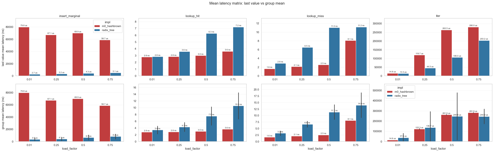
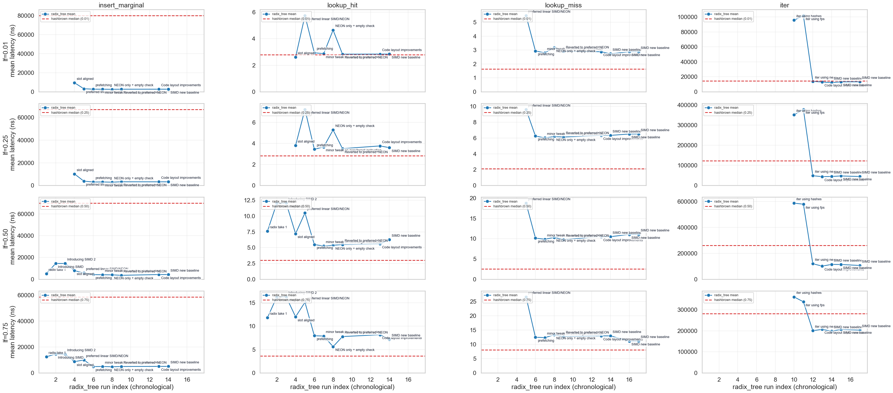
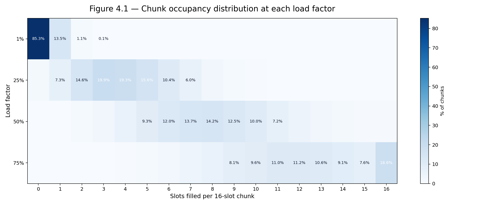
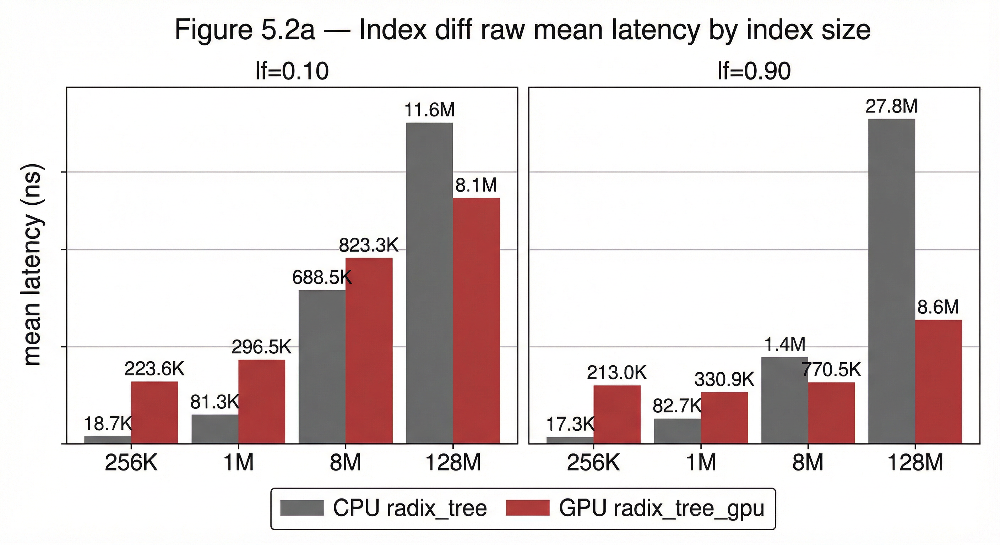

# One Index, Two Processors: A Radix Hash Design for Apple Silicon Unified Memory.

**Jordan — Datakey Pty Ltd / UNSW**

---

## Blog Introduction — Every book has a preferred place.

<!-- TONE: opinionated, quirky, passionate. This is the hook, not the research. -->

If you've found yourself bit-wrangling on the SIMD floor, optimising operations in the nanosecond and picosecond range — this research may interest you. If you've looked at the GPU sitting on the same die as your CPU and wondered why your database can't use it — read on.

Most databases in operation today are designed for CPUs. Branch logic, random access, speculative prefetching — these are CPU strengths, and we have had 40+ years of data structures and algorithm design to optimise our usage of them. B-trees, hash tables, LSM trees — the standard toolkit — are all built around how CPUs read memory. This is the workhorse of the information systems industry and it works.

GPUs represent a different beast. High-speed, highly parallel, uniform operations that in certain problems simply leave CPU approaches in the dust. ML training, inference engines, scientific simulation, rendering — these workloads live on GPU hardware, and the underlying data structures are uniquely designed for it. Uniform matrices, contiguous buffers, coalesced access patterns. A different architecture demands different structures.

We have databases for both. The humble CPU-backed database provides cheap and generally good performance across most information system operations. GPU compute excels at ML training, inference, vector operations found in similarity search and RAG systems — an industry clearly in rising demand. But here's the rub: the number of data operations that genuinely blend the two are far and few.

Machine learning and training pipelines will often leverage both CPU and GPU computation together, but they require separate data structures for each, and the transformation and transfer of those structures between processors to coordinate. This is effectively a batch design — load, compute, transfer — an outgrowth of the dual memory architecture that separates CPUs and GPUs. For ML model training this is completely fine. The cost of transferring or holding multiple data models is trivial compared to the value gained from GPUs in the training itself. And we have had 20 years of CUDA to propel this forward.

In realtime systems — inference engines, OLTP databases, data indexing — current systems stay in one lane or the other, with minimal to no crossover.

**Enter Apple Silicon Architecture.**

Apple has changed that equation. A unified memory layout accessible to both CPUs and GPUs alike. No dual data models in memory. No transfer costs. No requirement to design systems limited by batching between the two.

This architecture opens up a new set of opportunities for realtime data systems. With proper design of the data structures, we can leverage CPU when it is convenient to do so, and leverage GPU when it is in our interests to do so. This paper is about that crossover.

**Figure 0.1 — One index, two execution models**
*Conceptual diagram: a single contiguous byte array at centre. Two arrows diverge — CPU directed probe (single-key, nanosecond, scalar/NEON) and GPU batch scan (full-array, coalesced, Metal compute). Both paths read the same physical bytes at the same address. One structure, one memory layout, two modes of access.*


<!-- VISUAL: not a data figure — a conceptual/architectural diagram. Should be clean, minimal, readable at blog-post width. -->

Our paper explores the design of a common radix index optimised for both CPU-friendly and GPU-friendly operation. It is a humble data structure with a long lineage — IP routing tables, Linux kernel radix trees, in-memory databases like HyPer and DuckDB, key-value stores like LMDB. We leverage bit entropy and preferred slot placement to ensure proper distribution of records while minimising probe levels on insert and lookup. We look at the limits of bit entropy in light of the CPU architecture itself, leveraging SIMD cache-line layout and NEON register limits as floors in the benefits of entropy-directed placement.

We benchmark this against a standard hashbrown Swiss Table, with the expectation that the radix design is never as optimal as a randomly distributed hash table on certain CPU-friendly operations, while it excels at linear scan operations — which coincidentally is also where GPU performance gains begin to shine.

We then extend this benchmarking to GPU-friendly operations and their performance across different index sizes, occupancy rates, and query loads. These GPU operations demonstrate the relative benefits of a dual-design data model within a unified memory architecture.

The operations we benchmark are not directly mappable to standard database operations. It is our assertion that in order for a database to leverage both computing architectures, there needs to be a fundamental return to the drawing board on how these operations are built from the ground up — and that starts with the data structures themselves. There is no point trying to solve a SQL JOIN with the same random access patterns that have been optimised for CPU hardware if we wish to leverage a GPU compare. Instead, we break these operations into algebraic predicates — boolean evaluation across N arrays (A∩B, A\B, A∩B∩C) — that serve both what SQL compiles to in the backend and what Bayesian inference and probabilistic modelling are built on.

**Figure 0.2 — Unified memory vs discrete GPU memory architecture**
*Side-by-side comparison. Left: Apple Silicon unified memory — CPU and GPU share a single physical memory space, both read the same bytes at the same addresses, zero transfer overhead. The index exists once. Right: discrete GPU (NVIDIA/PCIe) — CPU and GPU have separate memory spaces connected by a bus. The index must either be duplicated (double storage, synchronisation cost) or transferred per operation (latency overhead).*


<!-- VISUAL: architectural diagram, not data. Should clearly show the single-memory vs dual-memory distinction and the cost implications for index operations. -->

To be clear, this radix index design is not the only data structure that could leverage this approach. Nor are we building a CPU-GPU database — only a proof of concept on dual-mode usage as a basis for future database design.

We also do not benchmark against GPU-only architectures. I would expect that at sufficient loads, we would see advantages with integrating GPUs — there would be a crossover — but the lack of a unified memory access pattern means we would be benchmarking what is already well understood in CUDA literature.

Finally, a note on why this has not been done. Unified memory is relatively new, and designing for it requires a systematic rebuild from the ground up. Apple is not in the data centre space, making this line of research commercially unattractive to SaaS providers, inference engine vendors, and the NVIDIA-dominant market at large. The addressable audience today is Apple developers, on-prem Mac deployments, and edge devices (and Apple Ltd itself, who, if you are reading, we would love some support). The paradigm gap between decades of CPU database engineering and a decade of CUDA-shaped GPU thinking means neither community has had a natural reason to explore the space between them.

---

## 1. The Problem Space

<!-- STRATEGY: Formal statement of the engineering problem. The blog intro told the story; this section states the problem precisely. A reader finishing §1 should understand: data structures encode hardware assumptions, the CPU/GPU boundary is a data structure problem not a memory problem, and unified memory is necessary but not sufficient. -->

Data structures encode hardware assumptions. A B-tree assumes that following a pointer to a child node is cheap — because on a CPU, it is. A hash table assumes that computing a hash and jumping to a random slot is cheap — because on a CPU with speculative prefetching, it is. These assumptions are so deeply embedded in database design that they are rarely stated explicitly. They are the water the fish swims in.

GPU hardware makes different assumptions. Coalesced sequential access is cheap. Divergent branching is expensive. Launching a million threads is trivial; launching one thread to follow a pointer chain is wasteful. The data structures designed for GPU — dense matrices, contiguous buffers, uniform-width elements — reflect these assumptions just as faithfully as B-trees reflect CPU assumptions.

When a system needs both processors, the data must be structured for one and made available to the other. In ML training pipelines, this means batch transfer: structure data for GPU, feed it across a bus, compute, return results. The cost is real but tolerable — GPU acceleration on training so dramatically outweighs the transfer overhead that the engineering community has rightly optimised for throughput across the boundary rather than elimination of it. Twenty years of CUDA development reflect this priority.

For realtime data systems the calculus is different. Inference engines, OLTP databases, and data indexing services operate under latency constraints where the transfer cost between CPU and GPU memory is not a rounding error — it is the bottleneck. A database query that could be answered in microseconds on a GPU cannot afford milliseconds of data transfer to get there. The batch-ship-return model that serves training well is fundamentally mismatched to realtime workloads.

Unified memory — as implemented in Apple Silicon — removes the physical boundary. CPU and GPU share a single memory pool at the same addresses. No transfer, no duplication. But removing the physical boundary does not remove the design problem. An index built for scattered random access does not become GPU-friendly simply because it now resides in memory the GPU can see. The B-tree is still a B-tree. The hash table still scatters. The data structure must be designed for both access patterns from the ground up.

This is the problem the paper addresses: can an index be designed to serve both CPU scalar operations and GPU batch operations from the same memory layout, without architectural compromise on either side?

We approach this in four stages. First, we design a radix hash index for Apple Silicon unified memory, leveraging bit entropy and preferred slot placement to distribute records while minimising probe depth on insert and lookup. We examine the limits of entropy-directed placement against the CPU architecture itself — SIMD cache-line layout and NEON register widths establish floors below which further bit partitioning yields no benefit.

Second, we benchmark this index against hashbrown, Rust's production Swiss Table implementation. The radix design is not expected to match a general-purpose hash table on every CPU operation. Where it loses and by how much is as important as where it wins.

Third, we extend benchmarking to GPU operations — scan, diff, set intersection, algebraic predicates, cardinality — across index sizes, occupancy rates, and query loads, measuring the crossover profile where GPU advantage emerges on unified memory.

Finally, we map these GPU primitives to the broader set of data-centric operations they compose — from database query evaluation to inference and probabilistic modelling — and extract the design principle that enables dual-mode access.

**Figure 1.1 — The design problem: same memory, incompatible access patterns**
*Left: a CPU-shaped index (B-tree or hash table) in unified memory — the GPU can see it but cannot efficiently traverse it. Scattered pointers, variable-width nodes, random access patterns. Right: a GPU-shaped structure (dense matrix) in the same memory — the CPU can see it but gains nothing from its parallelism for single-key lookup. Centre: the design question — what structure serves both?*


<!-- VISUAL: conceptual diagram. Not a data figure. Should illustrate the tension between CPU and GPU access patterns on shared memory. -->

---

## 2. The Geometry of Entropy: Placing Things Where They Can Be Found

A hash is a bit budget. A 128-bit hash contains more entropy than any single data structure can consume. The design question is how to spend those bits — which segments determine where a key is placed, and which segments identify the key once it's there.

We apply this bit budget to a single flat array, partitioned into a hierarchy of four levels. Buckets provide coarse location, determined by the highest-entropy bit segment. Groups are cache-line-aligned subdivisions within a bucket. Chunks are NEON-width (16-byte) subdivisions within a group. Slots are individual byte positions within a chunk, each holding one fp8 fingerprint. A key's hash determines its preferred coordinate — bucket, group, chunk, slot offset — and a separate 8-bit segment of the hash becomes the fp8 fingerprint stored at that position.

**Figure 2.1 — The hash as a segmented bar**
*A 128-bit hash visualised as a horizontal bar, divided into labelled segments: bucket bits, group bits, chunk bits, slot offset bits, fp8 bits, and remaining unused bits. Each segment is colour-coded to show which bits determine position (address) and which determine identity (fingerprint). The non-overlapping boundary between position and fingerprint segments is highlighted as the independence requirement.*


The critical design constraint — which we refer to as the independence requirement — is that position bits and fingerprint bits must be drawn from non-overlapping hash segments. If the fingerprint determines placement (same bits used for both), every key at a given position shares the same fingerprint by construction — a match tells you nothing. If position and fingerprint use independent bit segments, a match at the preferred position means the occupying key independently shares the same 8-bit fingerprint, providing genuine discriminating power on the probe. The practical per-probe false positive rate under independence is α/255 — load factor multiplied by fingerprint collision probability — qualified further in §4.

The number of position bits does not improve this per-probe FPR. What more position bits buy is placement precision: more distinct preferred positions means fewer collisions, which means fewer probes on average before a lookup resolves. The fp8 discrimination remains 1/255 at every probe regardless of how many position bits direct the key there. Position bits reduce probe depth. The fingerprint provides probe quality. Both matter, but they contribute differently.

**Figure 2.2 — Bit consumption through the hierarchy**
*Diagram showing how position bits are consumed as a key's address is resolved through each level: bucket narrows to one of many, group narrows further, chunk further still, slot offset to a single preferred position. At each level, the bits consumed are independent of the fp8. More position bits means more precise placement, which means fewer probes on average — the benefit is in probe depth reduction, not in compounding discrimination beyond the fp8's 8 bits.*


On collision — when a key's preferred slot is already occupied — the key can be directed to an alternative position using additional hash bits, maintaining random distribution properties without reusing the fingerprint bits.

Because the fp8 occupies a fixed-width byte per slot, the fingerprints can be stored in their own contiguous array, physically separate from the key data. The independence requirement is what makes this separated array useful — each byte carries genuine discriminating power precisely because it was not derived from the bits that placed the key there. Without independence, a separated fp8 array would be contiguous but uninformative. With it, the array becomes a viable surface for GPU batch operations — a property explored in §5.

### Geometry of the layout

The bucket → group → chunk → slot hierarchy is designed to align with hardware boundaries. Groups are cache-line-sized (64 bytes), chunks are NEON-register-sized (16 bytes). Probing a group is one cache line fetch. Scanning a chunk is one SIMD load. The geometry maximises the use of bit entropy for preferred placement while dedicating the minimum necessary bits to collision detection via the fp8 fingerprint. This is the mathematically efficient use of the available bit budget for the chosen hardware constraints — a different cache line size or SIMD width would produce a different geometry from the same principle.

**Figure 2.3 — Physical memory layout**
*A single bucket (256 bytes) shown as a contiguous block of memory. Subdivided into 4 groups of 64 bytes each, with cache line boundaries annotated. Each group subdivided into 4 chunks of 16 bytes each, with NEON register width annotated. Each chunk shows 16 individual byte slots. The diagram makes literal what the prose describes: probing a group is one cache line fetch, scanning a chunk is one SIMD load, and the entire structure is a flat contiguous array of single-byte elements.*

<!-- VISUAL: memory layout diagram. Rectangular, showing byte-level structure with hardware alignment boundaries clearly marked. Not a data figure — architectural. -->

---

## 3. The Index Architecture

§2 established the principle: position is information, independence is essential, and the geometry aligns with hardware boundaries. This section shows how that principle is instantiated in four concrete design decisions — bit sequence ordering, cache-line alignment, probe sequence, and overflow direction. Each decision is motivated by CPU performance, but each also has a direct consequence for GPU access patterns on unified memory.

**Bit sequence ordering.** The hash bits are consumed in the order: bucket, fp8, group, chunk, preferred slot offset. The fp8 is positioned before the directional bits (group, chunk, offset) but after the bucket. This ordering facilitates recalculation on collision — when a preferred slot is occupied, the directional bits can be shifted to draw from unused hash segments for an alternative position, without disturbing the fp8 or bucket. Buckets do not need this recalculation because they are probed sequentially on overflow. For GPU operations, the ordering is less critical — batch scans read every position regardless of how bits are sequenced. But the ordering ensures that the fp8 byte at each position is deterministic from the hash alone, which means co-indexed GPU scans across multiple arrays produce consistent results without needing to know the probe sequence.

**Cache-line alignment and the physical layout.** The fp8 array is laid out so that each group (64 bytes = 64 fp8 slots) aligns to a cache line boundary. A single group probe is guaranteed to be one cache fetch. Each group subdivides into 4 chunks of 16 bytes — one NEON register width. Scanning a chunk is a single SIMD load, and scanning a full group is four SIMD loads within one cache line. For GPU, the same alignment serves a different purpose: 64-byte cache-line-aligned groups map naturally to coalesced memory access patterns. A GPU thread group reading consecutive groups hits consecutive cache lines with no wasted bandwidth. The alignment was designed for CPU cache efficiency, but it simultaneously satisfies the GPU's coalesced access requirements.

```rust
/// 64-byte fingerprint group, cache-line-aligned.
#[repr(C, align(64))]
pub struct FpGroup(pub [u8; 64]);

/// Bucket: 4 cache-line-aligned groups (256 slots).
#[repr(C)]
pub struct Bucket {
    pub groups: [FpGroup; 4],
}
```

The `#[repr(C, align(64))]` annotation is not aspirational — it is enforced at the type level. Each `FpGroup` is exactly one cache line. Each `Bucket` is exactly four contiguous cache lines. The entire fingerprint arena is a flat `Vec<Bucket>` — a contiguous array of single-byte elements with hardware-aligned boundaries at every level of the hierarchy.

**Figure 3.1 — Physical layout: bucket → group → chunk → slot**
*A single bucket (256 bytes) = 4 groups (64 bytes each, cache-line-aligned), each group = 4 NEON-width chunks (16 bytes), each chunk = 16 fp8 slots. Annotations: cache line boundaries and NEON load widths.*

<!-- VISUAL: Reuses the same memory layout image as Figure 2.3. Both figures show the same physical structure; §2 introduces it as geometry, §3 annotates it with implementation detail. -->


**Figure 3.2 — Hash bit partitioning for a concrete configuration**
*capacity_bits=20: Bucket (12 bits), group (2 bits), slot/chunk (6 bits → chunk 2 bits + offset 4 bits), fp8 (8 bits), overflow (34 bits spare). A concrete instantiation of the abstract segmented bar from Figure 2.1.*


**The probe sequence: power-of-k-choices across chunks.** A group contains 4 chunks. Rather than linearly probing through slots within a single chunk, the hash derives a different preferred offset in each of the four chunks — four independent shots at an empty preferred slot. On insert, the key takes the first available preferred slot. On lookup, all four are checked as scalar probes. If all four preferred positions are occupied, the probe falls back to a sequential NEON scan of the full group. This is balanced allocations (Azar et al., 1994) applied at the sub-bucket level — §4.3 validates the occupancy distribution empirically. For GPU batch operations, the power-of-k-choices is irrelevant — the GPU reads every position in a single coalesced pass regardless of how keys were distributed among them. The probe sequence is a CPU optimisation that the GPU neither benefits from nor is penalised by.

**Figure 3.3 — The probe sequence: power-of-k-choices across chunks**
*A single group (4 chunks). Hash derives different preferred offset per chunk. Scalar probe sequence: p0→p1→p2→p3. If all four occupied, NEON fallback.*


**Overflow direction: same group, next bucket.** When a group is full (all preferred positions occupied and NEON scan finds no empty slot), the key overflows to the same group index in the next sequential bucket — not to the next group within the same bucket. The group coordinate is fixed by the hash; only the bucket advances. This preserves the (group, chunk, offset, fp8) coordinate tuple through overflow — the key's sub-bucket address and fingerprint are unchanged, only the coarse bucket location shifts. For GPU operations, same-group-next-bucket preserves the semantic identity of each group across bucket boundaries. If overflow instead went to the next group within the same bucket, keys from different hash prefixes would intermix within groups, complicating co-indexed operations across multiple arrays. The current design keeps each group position semantically consistent — a property that GPU predicate evaluation across co-indexed arrays depends on.

**Figure 3.4 — Overflow direction: same group, next bucket**
*Group g in bucket b overflows to group g in bucket b+1, not group g+1 in bucket b. Group coordinate fixed by hash. Only the bucket advances. The (group, chunk, offset, fp8) tuple is preserved through overflow.*


---

## 4. CPU Baselining

### 4.1 Against the Baseline

The baseline comparison is against hashbrown — Rust's default production hash map, based on Google's Swiss Table design (Kulukundis, 2017). It is SIMD-accelerated, heavily optimised, and battle-tested in production systems. If the radix index cannot justify itself against this baseline, the additional architectural complexity is not warranted. All comparisons in this subsection are at 256K index capacity, single-threaded, on Apple Silicon (M3).

*Personal Note: The radix index at certain operations will never beat a generic Swiss Table due simply to the fact that there are more SPU operations that must be performed. Having said that, the same is true in reverse — Swiss Table cannot compete on operations where the more efficient layout of information in memory matters. There is a reason radix indexes are heavily relied on in high-performance databases.*

**Table 4.1 — Final benchmark matrix: radix tree vs hashbrown**
*Operations (insert, lookup hit, lookup miss, iteration) × load factors (1%, 25%, 50%, 75%). Each cell shows mean latency for both structures and the ratio. The radix tree is slower but competitive on lookup (both hits and miss), faster on insert (higher entropy-directed placement for less collisions), and dramatically faster on iteration.*

| Load | hashbrown | radix_tree | Ratio |
|---|---|---|---|
| 1% | 15.3 µs | 13.0 µs | 1.2× faster |
| 25% | 272 µs | 43.9 µs | 6.2× faster |
| 50% | 523 µs | 101 µs | 5.2× faster |
| 75% | 666 µs | 207 µs | 3.2× faster |



**Figure 4.1 — Latency progression across runs**
*Matrix line chart: columns = operations (insert, lookup hit, lookup miss, iter), rows = occupancy levels. Run-by-run radix-tree mean latency with optimisation-tag labels and hashbrown reference baseline. Shows the progressive improvement as each design decision (§4.2, §4.3) is applied.*




The headline result from the baseline comparison is iteration performance.

**Table 4.2 — Iteration performance: radix tree vs hashbrown**
*The radix tree's contiguous fp8 layout produces 3–6× faster iteration across all load factors. The advantage is largest at moderate load (25%) where hashbrown's sparse slot array wastes the most cache fetches on empty control bytes.*

| Load | hashbrown | radix_tree | Ratio |
|---|---|---|---|
| 1% | 15.3 µs | 13.0 µs | 1.2× faster |
| 25% | 272 µs | 43.9 µs | 6.2× faster |
| 50% | 523 µs | 101 µs | 5.2× faster |
| 75% | 666 µs | 207 µs | 3.2× faster |

The iteration advantage is not algorithmic cleverness — it is memory layout. The fp8 array is contiguous and dense; hashbrown's slot array is sparse with control bytes interleaved. A sequential scan of the fp8 array saturates the memory bus with useful data. This same property — contiguous, cache-friendly, sequential access — is what makes the GPU operations in §5 possible. The layout that wins at iteration on CPU is the layout that wins at batch operations on GPU.

### 4.2 The SIMD Floor vs Scalar Probes

A natural question with entropy-directed placement: how much does it actually buy you against the CPU's own SIMD capability? If NEON can scan 16 bytes in a single instruction, does directing a key to a specific preferred slot matter — or does the hardware brute-force the answer before the bit manipulation pays off?

At low load, most slots are empty. A scalar check of the preferred position resolves almost immediately — the slot is empty, return "not found." At high load, the preferred position is likely occupied by a different key. The probe must search further, and NEON scanning 16 positions in parallel becomes cheaper than sequential scalar checks through occupied slots — we can loosely call this the hot path (quick scalar on low occupancy) and the slow path (full SIMD scans on higher occupancy rates).

**Table 4.3 — Scalar preferred placement vs full NEON scan**
*At each load factor, the latency of a scalar check at the entropy-directed preferred position versus a full NEON scan of the chunk. The crossover shows where the hardware's parallel capability overtakes directed placement.*

| Load (α) | Scalar preferred (ns) | Full NEON scan (ns) | Faster |
|---|---|---|---|
| 1% | (DATA PENDING) | (DATA PENDING) | — |
| 25% | (DATA PENDING) | (DATA PENDING) | — |
| 50% | (DATA PENDING) | (DATA PENDING) | — |
| 75% | (DATA PENDING) | (DATA PENDING) | — |

The hybrid strategy captures both: scalar pre-check of the preferred position, NEON fallback only when needed. At low load, the scalar check resolves before NEON would have finished loading. At high load, NEON is available immediately when the scalar check fails.

```rust
// Scalar check at preferred offset
let pref_byte = *fp_ptr.add(chunk_base + preferred_offset);
if pref_byte == fp {
    if *hash_ptr.add(chunk_base + preferred_offset) == id {
        return true;   // hit at preferred position
    }
} else if pref_byte == 0 {
    return false;       // empty slot — key absent
}

// NEON fallback — preferred offset excluded via bitmask
let vals = vld1q_u8(fp_ptr.add(chunk_base));
let match_mask = pack_neon_16(vceqq_u8(vals, target)) & !pref_bit;
```

The `pref_bit` mask excludes the preferred offset from the NEON scan — it was already checked by the scalar path. At low load, execution rarely reaches the NEON fallback. At high load, the scalar miss costs one byte read before NEON takes over.

**Table 4.4 — Pure NEON vs scalar-first with NEON fallback**
*The hybrid strategy recovers low-load performance while retaining high-load performance.*

| Load (α) | Pure NEON (ns) | Scalar-first + NEON fallback (ns) | Improvement |
|---|---|---|---|
| 1% | (DATA PENDING) | (DATA PENDING) | — |
| 25% | (DATA PENDING) | (DATA PENDING) | — |
| 50% | (DATA PENDING) | (DATA PENDING) | — |
| 75% | (DATA PENDING) | (DATA PENDING) | — |

The SIMD floor represents the CPU's best case for probe resolution — the point below which further entropy-directed placement yields no benefit because the hardware can scan an entire chunk in one operation. §5 asks what happens when the same contiguous layout meets GPU parallelism, where the "chunk" is the entire array.

### 4.3 Clustering and the Power of k Choices

Clustering is a well-known degradation pattern in linear probing. Knuth's analysis (Knuth, 1963) predicts that at 75% load, an expected 8.5 slots must be scanned on a miss — occupied runs grow, adjacent insertions extend those runs, and probe lengths increase superlinearly with load factor. Any index using preferred placement within a contiguous space must account for this.

The architecture described in §3 addresses clustering at the chunk layer. Rather than probing linearly within a single chunk when the preferred slot is occupied, the index derives a different preferred offset per chunk from independent hash bit segments — the power-of-k-choices (Azar et al., 1994) applied at the sub-bucket level. Four independent shots at an empty preferred slot across the group's four chunks. The four offsets come from independent hash bits; if they were correlated, the probes would cluster together and the advantage disappears. This is the same independence requirement that §2 establishes for position vs fingerprint bits, applied here at the chunk level.

The occupancy data validates the approach. Under linear probing within a single chunk, chunk 0 absorbs all sequential probes — at high load, it is heavily overloaded while chunks 1–3 are underutilised, and overflow into adjacent buckets is substantial.

**Table 4.5 — Occupancy distribution: linear probing (before)**
*Percentage of keys resolved at each level under single-chunk linear probing.*

| Load (α) | Resolved at preferred (scalar) | Resolved in chunk 0 (linear scan) | Chunks 1-3 | Overflow to next bucket |
|---|---|---|---|---|
| 25% | (DATA PENDING) | (DATA PENDING) | (DATA PENDING) | (DATA PENDING) |
| 50% | (DATA PENDING) | (DATA PENDING) | (DATA PENDING) | (DATA PENDING) |
| 75% | (DATA PENDING) | (DATA PENDING) | (DATA PENDING) | (DATA PENDING) |

With k=4 independent preferred offsets, each chunk independently has a 75% chance of its preferred slot being occupied at 75% load, but the probability that all four are occupied is 0.75⁴ = 31.6%. The remaining 68.4% resolve at a preferred slot in one of the four chunks via a single scalar probe. NEON fallback and overflow drop correspondingly.

**Table 4.6 — Occupancy distribution: power-of-k-choices (after)**
*Percentage of keys resolved at each level under k=4 independent preferred offsets.*

| Load (α) | Resolved at preferred (scalar) | Resolved in chunks 0-3 (NEON) | Overflow to next bucket |
|---|---|---|---|
| 25% | (DATA PENDING) | (DATA PENDING) | (DATA PENDING) |
| 50% | (DATA PENDING) | (DATA PENDING) | (DATA PENDING) |
| 75% | (DATA PENDING) | (DATA PENDING) | (DATA PENDING) |

**Figure 4.2 — Chunk occupancy heatmap: linear probing vs power-of-k-choices**
*Side-by-side heatmap at each load factor. Left/before: clustering visible as hot concentration in chunk 0 with long tails into overflow. Right/after: even distribution across all chunks with sharply reduced overflow.*



**Table 4.7 — P(all k preferred positions occupied) by load factor**
*Theoretical prediction from the balanced allocations model. The observed occupancy distributions (Tables 4.5 and 4.6, Figure 4.2) validate these predictions.*

| Load (α) | k=1 | k=2 | k=4 |
|---|---|---|---|
| 25% | 25% | 6.3% | 0.4% |
| 50% | 50% | 25% | 6.3% |
| 75% | 75% | 56.3% | 31.6% |

On GPU, none of this matters. The full-array scan visits every slot regardless of occupancy distribution — there is no hot path or slow path, only one coalesced pass. The placement intelligence optimised in §4.2 and §4.3 is a CPU concern. The GPU benefits from the same structure for a different reason entirely: the contiguous memory layout. As §5 will demonstrate, both benefit simultaneously from the same physical structure.

---

## 5. GPU Operations

All benchmarks in this section compare CPU and GPU execution of the same operation on the same index in unified memory. Both processors read the same physical bytes at the same addresses — there is no transfer cost, no duplication. The comparison isolates compute advantage from memory architecture.

### 5.1 Dispatch Overhead and the Crossover Profile

GPU utilisation carries a fixed overhead: kernel launch, buffer binding, thread group setup. At small index sizes this overhead dominates — the per-element work is too small to amortise the dispatch cost. As index sizes expand, the fixed cost is amortised across more elements and the GPU's bandwidth advantage emerges.

Iteration is the simplest full-array operation — one read per position, no computation beyond the read itself — and establishes the baseline crossover profile against which all subsequent operations are compared.

**Table 5.1 — Iteration: GPU vs CPU by index size and occupancy**

| Index size | Occupancy | CPU (mean) | GPU (mean) | GPU vs CPU |
|---|---|---|---|---|
| 256K | 0.10 | 31.1 µs | 280.1 µs | 0.11× (slower) |
| 256K | 0.90 | 202.9 µs | 369.0 µs | 0.55× (slower) |
| 1M | 0.10 | 362.2 µs | 387.5 µs | 0.93× (parity) |
| 1M | 0.90 | 842.4 µs | 686.6 µs | 1.23× (faster) |
| 8M | 0.10 | 4.19 ms | 1.36 ms | 3.09× (faster) |
| 8M | 0.90 | 6.38 ms | 3.87 ms | 1.65× (faster) |
| 128M | 0.10 | 84.53 ms | 11.29 ms | 7.49× (faster) |
| 128M | 0.90 | 110.09 ms | 44.76 ms | 2.46× (faster) |

The crossover is clean: GPU is slower at 256K, near parity at 1M, and decisively faster at 8M and above, reaching 7.49× at 128M. This is the reference curve — every subsequent operation is measured against it.

**Figure 5.1a — Iteration: raw mean latency by index size**
*Grouped column chart showing raw CPU and GPU mean latency (ns) by index size and occupancy. This provides absolute timing context for the normalized crossover curve.*


**Figure 5.1 — Iteration: CPU/GPU ratio by index size**
*Line chart. X-axis: index size. Y-axis: CPU/GPU ratio (higher is better). Horizontal parity line at 1.0. The curve starts below parity at small sizes, crosses near 1M, and rises strongly at larger sizes. This is the reference curve for subsequent operations.*


<!-- VISUAL: clean single-line chart with parity line annotated. -->

### 5.2 The Greedy Search Counterargument

The greedy search is the counterargument: both CPU and GPU perform a full linear scan of the entire array looking for a specific key. On CPU, the scan is sequential — NEON loads 16 bytes at a time, checks for fingerprint matches, confirms against the hash array. On GPU, the same logic is dispatched across all slots in parallel. Neither side uses the directed probe architecture from §3; both read everything.

**Table 5.2 — Greedy search: GPU vs CPU by index size and occupancy**

| Index size | Occupancy | CPU (mean) | GPU (mean) | GPU vs CPU |
|---|---|---|---|---|
| 256K | 0.10 | 9.7 µs | 212.7 µs | 0.05× |
| 256K | 0.90 | 1.8 µs | 244.1 µs | 0.01× |
| 1M | 0.10 | 6.5 µs | 287.1 µs | 0.02× |
| 1M | 0.90 | 45.1 µs | 256.4 µs | 0.18× |
| 8M | 0.10 | 88.5 µs | 573.5 µs | 0.15× |
| 8M | 0.90 | 521.6 µs | 585.8 µs | 0.89× |
| 128M | 0.10 | 4.80 ms | 6.10 ms | 0.79× |
| 128M | 0.90 | 23.62 ms | 5.99 ms | 3.94× |

GPU loses 7 of 8 points. The single win — 128M at 0.90 occupancy, 3.94× — shows that at sufficient scale and load, GPU parallelism overcomes CPU sequential scanning. But the aggregate geometric mean is 0.17×. The greedy search is a full-array operation on both sides — the difference is that CPU NEON sequential scanning has lower overhead than GPU dispatch for the same work. Only when the array is large enough does the GPU's parallel bandwidth advantage compensate for the dispatch cost. The broader architectural point remains: for single-key lookup, the directed probe from §3 would resolve in nanoseconds where both greedy paths scan microseconds to milliseconds of data.

### 5.3 Index Diff and Cardinality

Index diff takes two co-indexed arrays — a current index and a cached copy — and produces a bitmask of changed positions. XOR per element, compare to zero, emit bit. Cardinality is the popcount of that bitmask — a free reduction requiring no additional pass. The access pattern mirrors iteration (sequential coalesced pass, uniform work per element) with slightly more per-element compute. The crossover profile is expected to track the iteration reference curve.

**Figure 5.2a — Index diff: raw mean latency by index size**
*Grouped column chart showing raw CPU and GPU mean latency (ns) by index size and occupancy for index diff.*



**Figure 5.2 — Index diff: CPU/GPU ratio by index size**
*Line chart overlaid against the iteration reference curve. Confirms whether diff tracks the iteration crossover profile after adding per-element compare work.*


### 5.4 Algebraic Predicates and the Arity Scaling Arc

Set predicate operations evaluate boolean algebra across co-indexed arrays — intersection, difference, consensus, uniqueness. The benchmarks span three arity levels: 2-array, 3-array, and 5-array predicates. The progressive results are the strongest finding in this section.

**Family-2 (2-array predicates).** Intersection (A∩B), difference (A−B), symmetric difference. Geomean GPU advantage: 5.84×. The crossover profile shifts leftward relative to iteration — at 256K the advantage is marginal (1.1–1.4×), but GPU is already faster at every index size. At 128M with high load, individual predicates reach 29–31× advantage.

**Family-3 (3-array predicates).** Consensus and unique ownership across three arrays. Geomean GPU advantage: 8.66× — a 1.48× normalised lift over Family-2. At 256K, the GPU advantage is 2.0–2.4×. The dispatch overhead that iteration cannot overcome at this size is overcome by the additional per-position work. The crossover has shifted further left.

**Family-5 (5-array predicates).** Consensus, quorum (3-of-5), and unique ownership across five arrays. Geomean GPU advantage: 13.03× — a further 1.50× lift over Family-3, and 2.23× over Family-2. At 256K, the GPU advantage is 3.4–3.9×. The dispatch overhead is a rounding error relative to the per-position work.

**Table 5.3 — Predicate family summary**

| Family | Predicates | GPU vs CPU (geomean) | Lift over previous | Worst point | Best point |
|---|---|---|---|---|---|
| Family-2 | intersect, diff, sym_diff | 5.84× | — | 0.81× (256K) | 29.70× (128M) |
| Family-3 | consensus_3, unique_a | 8.66× | 1.48× over F2 | 1.77× (256K) | 31.82× (128M) |
| Family-5 | consensus_5, quorum_3of5, unique_a_5 | 13.03× | 1.50× over F3 | 2.79× (256K) | 45.53× (128M) |

Each additional arity level adds approximately 50% more normalised GPU advantage. The reason is structural: on GPU, additional arrays are additional mask evaluations per thread in the same dispatch — same memory traffic pattern, near-zero marginal cost per additional predicate. On CPU, each additional array is either another pass over the data or a more complex fused loop with increasing register pressure and cache contention. GPU cost is approximately flat across arity. CPU cost scales with it.

The Metal kernels make this visible. A 2-array predicate:

```metal
kernel void set_predicate_2(
    const device uchar* fp_a [[buffer(0)]],
    const device uchar* fp_b [[buffer(1)]],
    device uint* matches     [[buffer(2)]],
    device atomic_uint* count [[buffer(3)]],
    constant uchar& mask     [[buffer(4)]],
    uint gid [[thread_position_in_grid]]
) {
    uchar a = fp_a[gid];
    uchar b = fp_b[gid];
    uint state = (uint(a != 0) << 2) | (uint(b != 0) << 1) | uint(a == b);
    if ((mask >> state) & 1) {
        uint idx = atomic_fetch_add_explicit(count, 1, memory_order_relaxed);
        matches[idx] = gid;
    }
}
```

A 5-array predicate — same dispatch pattern, same mask lookup, five buffer reads instead of two:

```metal
kernel void set_predicate_5(
    const device uchar* fp_a [[buffer(0)]],
    const device uchar* fp_b [[buffer(1)]],
    const device uchar* fp_c [[buffer(2)]],
    const device uchar* fp_d [[buffer(3)]],
    const device uchar* fp_e [[buffer(4)]],
    device uint* matches     [[buffer(5)]],
    device atomic_uint* count [[buffer(6)]],
    constant uchar* mask     [[buffer(7)]],
    uint gid [[thread_position_in_grid]]
) {
    uchar a = fp_a[gid]; uchar b = fp_b[gid]; uchar c = fp_c[gid];
    uchar d = fp_d[gid]; uchar e = fp_e[gid];

    uint state = (uint(a != 0) << 14) | (uint(b != 0) << 13)
               | (uint(c != 0) << 12) | (uint(d != 0) << 11)
               | (uint(e != 0) << 10)
               | (uint(a == b) << 9)  | (uint(a == c) << 8)
               | (uint(a == d) << 7)  | (uint(a == e) << 6)
               | (uint(b == c) << 5)  | (uint(b == d) << 4)
               | (uint(b == e) << 3)  | (uint(c == d) << 2)
               | (uint(c == e) << 1)  | uint(d == e);

    if ((mask[state >> 3] >> (state & 7)) & 1) {
        uint idx = atomic_fetch_add_explicit(count, 1, memory_order_relaxed);
        matches[idx] = gid;
    }
}
```

The structure is identical. The 5-array kernel reads three more buffers and computes a 15-bit state instead of a 3-bit state — but the memory access pattern, dispatch geometry, and mask lookup are unchanged. The additional work per thread is integer comparison and bit shifting, which is effectively free relative to the memory traffic. This is why GPU cost is approximately flat across arity while CPU cost scales with it.

**Table 5.4 — Two-dimensional scaling: index size × predicate family**
*GPU vs CPU geomean at each index size, by family. Both axes — bigger index and higher arity — increase GPU advantage independently, and they multiply.*

| Index size | Family-2 | Family-3 | Family-5 |
|---|---|---|---|
| 256K | 1.41× | 2.36× | 3.85× |
| 1M | 4.50× | 6.93× | 10.70× |
| 8M | 11.99× | 17.25× | 25.05× |
| 128M | 15.33× | 19.88× | 27.88× |

**Figure 5.3 — Algebraic predicates: GPU/CPU ratio by index size, all families**
*Line chart. Three line groups — Family-2, Family-3, Family-5 — fanning apart as index size increases. The vertical separation between families is the arity scaling arc. At every index size, higher arity means stronger GPU advantage.*

**Figure 5.3a — Algebraic predicates: raw mean latency by family and index size**
*Consolidated raw-data matrix (CPU gray, GPU red) showing family-level geomean mean latency across index sizes and occupancies.*


<!-- VISUAL: the key figure for the arity argument. Clean, well-labelled, with iteration reference curve included for comparison. -->

### 5.5 GPU Conclusions

Operation shape determines GPU value. Coalesced full-array operations with per-element computation (predicates, diff) cross over early and scale with index size. Full-array operations with minimal per-element work (greedy search, iteration) require larger arrays before GPU parallelism overcomes dispatch overhead. This is a property of the work-per-position ratio, not of the access pattern — greedy search and iteration are both coalesced full-array scans, but their per-element compute is too light to amortise dispatch at smaller sizes.

GPU advantage scales with work-per-position. The arity arc from Family-2 through Family-5 demonstrates this empirically — each step compounds approximately 1.5× normalised lift, because additional predicates are additional mask evaluations in the same GPU dispatch while they are additional passes or fused complexity on CPU.

On unified memory, the index is a shared compute surface. CPU uses it for directed scalar probes. GPU uses it for batch array operations. Both read the same physical bytes. The placement intelligence optimised in §4 serves CPU. The contiguous layout serves GPU. §6 maps these primitives to the broader set of data-centric operations they compose.

**Figure 5.4 — GPU/CPU ratio by index size: all operations overlaid**
*Line chart with all operations on one set of axes: iteration (baseline), greedy search, Family-2, Family-3, Family-5. Parity line at 1.0. The arity fan is the visual takeaway — lines spreading apart as index size grows, Family-5 at the top, greedy search at the bottom.*


<!-- VISUAL: the headline figure for §5. -->

**Table 5.5 — GPU crossover summary**

| Operation | Array count | Crossover size (GPU ≈ CPU) | GPU advantage at 128M |
|---|---|---|---|
| Iteration | 1 | ~1M | 2.46–7.49× |
| Index diff | 2 | (DATA PENDING) | (DATA PENDING) |
| Family-2 predicates | 2 | <256K | 11.1–28.8× |
| Family-3 predicates | 3 | <256K | 17.9–19.9× |
| Family-5 predicates | 5 | <256K | 25.0–37.9× |
| Greedy search | 1 | ~128M (high load only) | 3.94× (0.90 only) |

---

## 6. Toward GPU-Native Database Design

The GPU operations benchmarked in §5 — scan, diff, intersection, algebraic predicates, cardinality — were measured as isolated primitives. This section asks whether they compose into operations that data systems actually perform, and whether the arity scaling from §5.4 maps to the scaling of real query complexity.

### 6.1 From Primitives to Operations

**Table 6.1 — Benchmarked primitives and what they build**

| Primitive | What it does | Data operations built from it |
|---|---|---|
| Scan | Visit every element, filter or collect | Table scan, feature extraction, batch inference input, training data sampling |
| Element-wise diff | Compare two co-indexed arrays, emit changes | Change detection, incremental retrain triggers, cache invalidation, replication delta |
| Set intersection | Positions where two arrays agree | Join, entity matching, deduplication, dataset overlap estimation |
| Algebraic predicates | Boolean evaluation across N arrays | Multi-way join/anti-join, composite filter, ensemble disagreement, multi-source feature agreement |
| Cardinality | Count of positions satisfying a predicate | Selectivity estimation, convergence metrics, sampling budgets |

The boundaries should be stated. Ordering (sort, rank, top-k), structural traversal (graph walks, tree descent), and aggregation (sum, average, group-by) fall outside what these primitives compose. Everything within the boolean/set-algebra core maps directly — any predicate expressible as "for each position, does this combination of conditions hold across these arrays?" composes from the benchmarked operations.

### 6.2 Query Complexity and the Arity Arc

The arity scaling from §5.4 is not a benchmark curiosity. It maps directly to the scaling of real query complexity. Consider a progression of SQL operations over co-indexed tables:

A simple two-table join:

```sql
SELECT a.id
FROM table_a a
JOIN table_b b ON a.id = b.id
WHERE a.status = b.status;
```

This is a 2-array predicate — intersection of matching values at co-indexed positions. §5.4 measured this class at 5.84× GPU advantage (geomean across sizes and loads).

A three-table join:

```sql
SELECT a.id
FROM table_a a
JOIN table_b b ON a.id = b.id
JOIN table_c c ON a.id = c.id
WHERE a.status = b.status
  AND a.status = c.status;
```

This is a 3-array consensus predicate. §5.4 measured this class at 8.66× GPU advantage — a 1.48× lift over the 2-array case.

A five-table join with quorum logic:

```sql
SELECT a.id
FROM table_a a
JOIN table_b b ON a.id = b.id
JOIN table_c c ON a.id = c.id
JOIN table_d d ON a.id = d.id
JOIN table_e e ON a.id = e.id
WHERE (
  -- at least 3 of 5 sources agree on status
  (a.status = b.status AND a.status = c.status)
  OR (a.status = b.status AND a.status = d.status)
  OR (a.status = b.status AND a.status = e.status)
  OR (a.status = c.status AND a.status = d.status)
  OR (a.status = c.status AND a.status = e.status)
  OR (a.status = d.status AND a.status = e.status)
);
```

This is a 5-array quorum predicate. §5.4 measured this class at 13.03× GPU advantage — 2.23× over the 2-array case.

The scaling principle is structural. On GPU, each additional table is an additional mask evaluation per thread in the same dispatch — same memory traffic pattern, near-zero marginal cost per additional predicate. On CPU, each additional table is either another pass over the data or a more complex fused loop with increasing register pressure and cache contention. GPU cost is approximately flat across arity. CPU cost scales with it.

**Table 6.2 — Query complexity scaling: SQL arity mapped to GPU advantage**

| Query pattern | SQL equivalent | Array arity | GPU vs CPU (geomean) | Lift over 2-array |
|---|---|---|---|---|
| Simple join | 2-table JOIN with equality filter | 2 | 5.84× | — |
| Consensus join | 3-table JOIN, all agree | 3 | 8.66× | 1.48× |
| Quorum join | 5-table JOIN, 3-of-5 agree | 5 | 13.03× | 2.23× |

The two-dimensional scaling from §5.4 confirms this is not a single-axis effect. Both query complexity (arity) and data volume (index size) increase GPU advantage independently, and they multiply:

**Table 6.3 — GPU advantage by index size and query complexity**

| Index size | 2-array | 3-array | 5-array |
|---|---|---|---|
| 256K | 1.41× | 2.36× | 3.85× |
| 1M | 4.50× | 6.93× | 10.70× |
| 8M | 11.99× | 17.25× | 25.05× |
| 128M | 15.33× | 19.88× | 27.88× |

At 128M slots with 5-array predicates, the GPU delivers 27.88× advantage. At the peak measured point (128M, high load, high overlap), individual 5-array predicates reach 45.5×. These are not theoretical projections — they are measured values on the index architecture described in §§2–3.

The SQL examples above are illustrative, not literal. These primitives do not implement a SQL query planner. They implement what a query planner compiles to — the boolean evaluation kernel at the bottom of the execution plan. The same primitives serve workloads outside SQL entirely: training pipelines performing deduplication across dataset versions (intersection), inference pipelines evaluating ensemble agreement across model outputs (consensus), and feature engineering measuring co-occurrence across modalities (multi-way intersection). The access pattern is identical in every case.

### 6.3 The Design Principle

The GPU crossover profiles in §5 and the scaling arc in §6.2 are consequences of how the index lays out data, not what it stores. The fingerprint is 8 bits in our benchmarks — a 16-bit tag, a 32-bit hash prefix, or a quantised vector component would produce the same crossover profile. What matters is the physical structure of the storage.

Current database indexes were not designed with GPU access as a constraint. B-trees use pointer-linked nodes — each fetch is a random memory access. Hash tables scatter slots by hash function — lookup is fast but iteration is sparse. LSM trees are sequential within a sorted run but scatter across levels during compaction. Each optimises for what CPUs do well: fast random access, branch prediction, speculative prefetching. None is designed for coalesced sequential access across the full structure.

**Table 6.4 — Index design: CPU-shaped vs GPU-native**

| Property | B-tree | Swiss Table | Radix hash index | Why GPU needs it |
|---|---|---|---|---|
| Contiguous | No (pointer-linked) | Partial (groups, sparse) | Yes | Coalesced access |
| Position-stable | No (rebalancing) | No (rehashing) | Yes | Co-indexed operations across arrays |
| Cache-line aligned | Per-node (variable) | Per-group (16 bytes) | Per-group (64 bytes) | Aligned to hardware access width |
| Uniform element size | No (variable keys) | No (key+value interleaved) | Yes (1 byte/slot) | Thread-per-element dispatch without divergence |
| Separable metadata | No | Partial (control bytes) | Yes (metadata layer separate from key store) | Batch operations over metadata only |

Any index primitive satisfying these properties should exhibit a similar GPU crossover profile regardless of element width or semantics. The design principle is not "use this specific index" — it is "build indexes that are contiguous, uniform, position-stable, and separable."

### 6.4 The Unified Memory Dependency

The §5 benchmarks depend on a specific hardware property: CPU and GPU share physical memory and address space. Current Apple Silicon (M-series) provides up to 546 GB/s bandwidth to a unified memory pool accessible equally by CPU and GPU. No cross-pool transfer, no synchronisation, no duplication. NVIDIA GH200 — the closest comparison — provides 900 GB/s via NVLink-C2C, but actual cross-pool bandwidth between CPU and GPU memory is 130–168 GB/s with 800–1000ns latency. Raw GPU compute is faster on NVIDIA. But every operation that touches data in the other processor's memory pays a tax that unified memory does not have.

In practice, the unified memory thesis reduces to two lines of code. The CPU allocates page-aligned memory for the fingerprint arena. The GPU binds the same pointer as a Metal buffer — no copy, no transfer:

```rust
// CPU: page-aligned allocation (zeroed, suitable for Metal)
let fp_ptr = posix_memalign(4096, total_slots);

// GPU: zero-copy buffer wrapping the same physical bytes
let fp_buf = device.new_buffer_with_bytes_no_copy(
    fp_ptr, page_ceil(total_slots), StorageModeShared, None
);
```

From this point, `fp_ptr` and `fp_buf` reference the same memory. CPU scalar probes read through the pointer. GPU kernels read through the buffer. Both see every write immediately. The entire dual-mode architecture depends on this single property.

The crossover points in §5 (Table 5.5) are therefore architecture-specific. On discrete GPU, the crossover shifts rightward — more work per operation is needed to overcome transfer overhead. §8 flags this as an open question.

The cost should be stated. The radix index pays a penalty on single-key lookup compared to hashbrown (Table 4.1) — the price of the richer geometry. The gain: iteration 3–6× faster, GPU batch operations 5.8–13.0× faster at scale depending on query complexity. Whether the trade-off is worthwhile depends on the workload's ratio of scalar lookups to batch operations. Analytical and ML workloads heavily favour batch. Pure OLTP point lookups do not.

---

## 7. Concluding Remarks

This paper presents a radix hash index whose internal geometry — contiguous, cache-line-aligned, position-stable, with separable metadata — is designed from the ground up for dual-mode access on unified memory: CPU scalar probes and GPU batch operations over the same physical bytes.

### What we found

Two results. The first is architectural: the five properties enumerated in §6.3 (Table 6.4) are not independent features bolted together. They emerge from a single layout decision (§2–3). The same structure that gives CPU its directed probe path gives GPU its coalesced access pattern.

The second is empirical: GPU advantage compounds with query complexity. Each additional predicate adds approximately 50% normalised GPU lift while adding linear cost on CPU. This is not a fixed multiplier — it is a function of operation shape, data volume, and query complexity, and it compounds favourably on all three axes. §6.4 states the cost honestly.

### Why the opportunity is open

GPU-accelerated databases are not new. MapD (now HEAVY.AI), BlazingSQL, PG-Strom, and others have demonstrated GPU analytics at scale. What these systems share is a common architecture: the GPU is an accelerator. Data is transferred to GPU memory for compute, or maintained as a GPU-resident copy. The GPU lives across a bus, and every operation pays the cost of that crossing — either in transfer latency or in storage duplication and synchronisation.

What is different on Apple Silicon unified memory is structural. The GPU is not an accelerator you ship data to — it is a co-processor reading the same bytes at the same address. But leveraging this requires data structures explicitly designed for the task. To date, no database engine has been built from the ground up for unified memory dual-mode access, for three reasons:

- **Ground-up design requirement.** A database leveraging dual-mode access cannot be retrofitted. The index primitives must be designed for both CPU and GPU access patterns simultaneously. Existing databases were built for CPU, or GPU in some cases, but not both.
- **Market positioning.** Apple Silicon is not in the data centre race. Unified memory is most valuable where databases run — servers and clusters — but the addressable market is Apple developers, on-prem deployments, and edge devices. This limits incentive for vendors.
- **Paradigm gap.** Database engineering has decades of CPU-optimised design and GPU compute has a decade of CUDA-shaped thinking — discrete memory, explicit transfers, batch-ship-return. Unified memory falls between these two traditions, and neither community has had a natural reason to explore it.

The gap is empirically visible. Serdar et al. ran TPC-H queries on Apple Silicon comparing DuckDB, CPU NumPy, and GPU MLX kernels. GPU analytics lost on joins because existing data structures imposed scatter/gather access patterns. The GPU compute was available — the data structures could not use it. The benchmarks in §5 show what changes when the structure is designed for coalesced access from the start.

### Where it leads

The paper demonstrates the index primitive on uniformly distributed keys with synthetic workloads. The most immediate extension is scaling to real analytical workloads — the TPC-H queries that Serdar et al. showed GPU losing on joins. The arity scaling from §6.2 predicts that multi-way joins on GPU-native structures should outperform CPU execution by an increasing margin as query complexity grows. Validating this prediction on production query plans is the next empirical step.

**Table 7.1 — Summary: what the index provides**

| Property | Value |
|---|---|
| Local lookup (hit, low load) | Competitive with hashbrown |
| Local lookup (hit, 75% load) | Slower than hashbrown (Table 4.1) |
| Iteration | 3–6× faster than hashbrown |
| GPU advantage (2-array predicates) | 5.84× geomean, up to 29.7× at scale |
| GPU advantage (3-array predicates) | 8.66× geomean, up to 31.8× at scale |
| GPU advantage (5-array predicates) | 13.03× geomean, up to 45.5× at scale |
| Arity scaling | ~1.5× normalised lift per additional array |
| GPU crossover (iteration) | ~1M slots |

---

## 8. Open Questions

GPU crossover on non-Apple architectures is the most significant open question. The benchmarks in §5 are measured on Apple Silicon unified memory, where CPU and GPU share physical bytes without transfer overhead. On discrete GPU architectures (NVIDIA, AMD) with PCIe or NVLink transfer, the crossover profile will differ — raw GPU compute may be faster, but the transfer cost adds a fixed overhead per operation that shifts the crossover point rightward. Whether the net effect improves or degrades total system performance for the predicate operations in §5.4 is an open empirical question. The arity scaling principle (near-zero marginal cost per additional predicate on GPU) should hold regardless of memory architecture, but the absolute crossover points will move.

Validation on production query plans is the second open question. The SQL mappings in §6.2 are illustrative — they show the structural correspondence between multi-table joins and multi-array predicates. Whether the measured GPU advantage translates to end-to-end query performance depends on factors this paper does not address: query planning overhead, result materialisation cost, and the proportion of total query time spent in the predicate evaluation kernel versus other stages.

Element width generalisation is the third. The benchmarks use 8-bit elements. §6.3 argues that the GPU crossover profile is a property of the physical layout, not the element width. This claim is supported by the design principle but has not been empirically validated for 16-bit, 32-bit, or wider elements. Wider elements increase per-position memory bandwidth, which may shift the arity scaling curve — whether favourably or unfavourably is not yet measured.

---

## References

- Azar, Y., Broder, A. Z., Karlin, A. R., & Upfal, E. (1994). Balanced Allocations. *STOC*, 593–602.
- Bender, M. A., Conway, A., Farach-Colton, M., Kuszmaul, W., & Tagliavini, G. (2021). Iceberg Hashing. *JACM*, 70(6), 1–51.
- Farach-Colton, M., Krapivin, A., & Kuszmaul, W. (2025). Optimal Bounds for Open Addressing Without Reordering. arXiv:2501.02305v2.
- Knuth, D. E. (1963). Notes on "Open" Addressing. Unpublished memorandum.
- Kulukundis, M. (2017). Designing a Fast, Efficient, Cache-friendly Hash Table, Step by Step. CppCon 2017.
- Pagh, R., & Rodler, F. F. (2004). Cuckoo Hashing. *Journal of Algorithms*, 51(2), 122–144.
- Pandey, P., Bender, M. A., Johnson, R., & Patro, R. (2017). A General-Purpose Counting Filter. *SIGMOD*, 775–787.
- Peterson, W. W. (1957). Addressing for Random-Access Storage. *IBM J. Res. Dev.*, 1(2), 130–146.
- Vöcking, B. (2003). How Asymmetry Helps Load Balancing. *JACM*, 50(4), 568–589.
- Yao, A. C. (1985). Uniform Hashing is Optimal. *JACM*, 32(3), 687–693.